# Equipo: APM - ToyLab

- **Página web:** [APM ToyLab](https://apmtoylab.fcruzv.com/) FALTA: MODIFICAR FOTOS
- **Repositorio GitHub:** [GitHub - APMToyLab](https://github.com/SaraC27/APMToyLab)
- **Video presentación proyecto:** [Enlace Youtube]() (*no disponible aún*)

## Integrantes del equipo

- **Sara Valentina Cardona Mejía**
- **Juan Andrés Barrera Rodríguez**
- **Manuel Felipe Carranza Montenegro**
- **Felipe Cruz Vásquez**

# Tabla de Contenido

1. [Módulos](#módulos) 
   - [Módulo 1: Gestión de Producción y Automatización](#módulo-1-gestión-de-producción-y-automatización)  
     - [Pre-Automatización](#pre-automatización) MODIFICAR: J/S
       - [Indicadores](#indicadores)
       - [Tecnomatix](#tecnomatix)
       - [VSM](#vsm-pre)
     - [Post-Automatización](#post-automatización) MODIFICAR: J/S
       - [Indicadores](#indicadores-post)
       - [Tecnomatix](#tecnomatix-post)
       - [VSM](#vsm-post)
     - [Propuesta automatización](#propuesta-automatización) MODIFICAR: J/S
     - [Análisis de Mercado](#análisis-de-mercado) YA
     - [Sistema MES](#sistema-mes) YA

   - [Módulo 2: Industria 4.0 en la Automatización](#módulo-2-industria-40-en-la-automatización)  
     - [Pre-Automatización](#pre-automatización-40)  
       - [Diagramas P&ID](#diagramas-pid) FALTA: S
       - [Diagrama Arquitectura / Tecnologías 4.0](#diagrama-arquitectura) FALTA: F
     - [Post-Automatización](#post-automatización-40)  
       - [Diagramas P&ID](#diagramas-pid-post) FALTA: S
       - [Diagrama Arquitectura / Tecnologías 4.0](#diagrama-arquitectura-post) FALTA: F
       
   - [Módulo 3: Planeación del Proyecto](#módulo-3-planeación-del-proyecto)  
     - [MES/ERP](#erp) FALTA: FELIPE
     - [EDT](#edt) YA
     - [Cronograma](#cronograma) YA
     - [Bitácoras](#bitácoras) FALTA: F

   - [Módulo 4: Evaluación Económica de Proyectos](#módulo-4-evaluación-económica-de-proyectos)  FALTA: F (REVISAR ENTRE TODOS)
     - [Economía del Proyecto](#economía-del-proyecto) 
       - [Presupuesto](#presupuesto)  
       - [Costos](#costos)  
       - [Flujo de Caja](#flujo-de-caja)  
     - [Análisis rentabilidad](#análisis-rentabilidad)   
       - [VPN](#vpn)  
       - [TIR](#tir)  
       - [Payback](#payback)  
     - [Oferta comercial](#oferta-comercial)

   - [Módulo 5: Celda de Manufactura Robotizada](#módulo-5-celda-de-manufactura-robotizada) MODIFICAR: M  
     - [Justificación y valor agregado](#justificación-y-valor-agregado) 
     - [Diseño](#diseño)  
       - [Relación con el proceso de manufactura](#relación-con-el-proceso-de-manufactura)
       - [Funcionalidad del robot](#funcionalidad-del-robot) 
       - [Interacción con operarios](#interacción-con-operarios) 
       - [Análisis y gestión de riesgos](#análisis-y-gestión-de-riesgos) 
       - [Seguridad](#seguridad) 
     - [RobotStudio](#robotstudio)  
       - [Modelado](#modelado) 
       - [Programación](#programación)
       - [Simulación](#simulación)  

   - [Módulo 6: Digital Factory](#módulo-6-digital-factory) MODIFICAR: J 
     - [Siemens NX](#siemens-nx)  
       - [Entorno y modelamiento](#entorno-y-modelamiento)
       - [Actuadores virtuales](#actuadores-virtuales)
       - [Sensores virtuales](#sensores-virtuales)
       - [Simulación](#simulación-digital-factory)  

   - [Módulo 7: Controladores industriales (PLC)](#módulo-7-controladores-industriales-plc) FALTA: F
     - [Selección de controladores](#selección-de-controladores)  
     - [Desglose de la lógica](#desglose-de-la-lógica)
       - [Etapas](#etapas)
       - [Transiciones](#transiciones)
       - [Modos](#modos)
     - [Programación](#programación-plc)  
       - [Grafcet](#grafcet)  
       - [Ladder](#ladder)  
     - [Studio 5000](#studio-5000)  
       - [Programación e integración](#programación-e-integración)  
       - [Simulación](#simulación-plc)  

   - [Módulo 8: SCADA](#módulo-8-scada) FALTA: S 
     - [HMI](#hmi)  
       - [Variables clave](#variables-clave)  
       - [Diseño](#diseño-hmi)  
       - [Desarrollo](#desarrollo)  
       - [Validación](#validación)  
       - [Elementos de alto desempeño](#elementos-de-alto-desempeño)  
     - [Ignition](#ignition)  
       - [Integración control](#integración-control)  
       - [Integración supervisión](#integración-supervisión)  

2. [Resultados](#resultados) FALTA: TODOS  
   - [Resultados de aprendizaje](#resultados-de-aprendizaje)  
     - [Grupal](#grupal)  
     - [Individual](#individual)  
   - [Resultados de ingeniería](#resultados-de-ingeniería)  
     - [Módulo 1](#resultados-módulo-1)  
     - [Módulo 2](#resultados-módulo-2)  
     - [Módulo 3](#resultados-módulo-3)  
     - [Módulo 4](#resultados-módulo-4)  
     - [Módulo 5](#resultados-módulo-5)  
     - [Módulo 6](#resultados-módulo-6)  
     - [Módulo 7](#resultados-módulo-7)  
     - [Módulo 8](#resultados-módulo-8)  

# Módulos

## Módulo 1: Gestión de Producción y Automatización

Una fábrica de juguetes de plástico desempeña un papel crucial en la industria manufacturera y en la sociedad en general. Los juguetes no solo son herramientas esenciales para el entretenimiento infantil, sino también para el desarrollo cognitivo, emocional y social de los niños. Estos productos fomentan la creatividad, la imaginación y las habilidades motoras. 

Por esto mismo es fundamental que la planta cumpla con las demandas de producción establecidas para garantizar un suministro constante que satisfaga las necesidades del mercado. Asimismo, mantener las tecnologías actualizadas permite optimizar los procesos, reducir costos operativos y mejorar la eficiencia general. Esto no solo contribuye a la sostenibilidad al minimizar el impacto ambiental, sino que también refuerza la competitividad de la planta, asegurando su relevancia y capacidad para adaptarse a las exigencias de un mercado en constante evolución.

### Planta pre-automatización

Antes de implementar un proceso de automatización, es importante comprender las características fundamentales de la planta en su estado inicial. A continuación, se presentarán las características más relevantes de la planta, esenciales para identificar áreas de mejora y garantizar una transición eficiente hacia un modelo más avanzado.

La planta comprende un espacio total de **40x45 m** y tiene únicamente un nivel. Además de esto, cuenta con las siguientes etapas de manufactura que garantizan la producción de los juguetes de calidad que caracterizan a la empresa.

#### Etapas del proceso de manufactura

- Mezclado de plástico con pigmentos y aditivos según el color deseado (rojo y blanco).
- Dosificación de plástico en pequeñas cantidades, según la capacidad de las inyectoras de plástico.
- Inyección para formar las diferentes piezas, separadas en las siguientes categorías:
  - Detalles
  - Partes móviles
  - Cuerpos
- Uso de herramientas como escalpelo y soplete para retirar las rebabas de las piezas moldeadas.
- Ensamble parcial de cuerpos y detalles específicos de cada juguete.
- Ensamble parcial de piezas móviles, como ejes con ruedas o hélices.
- Ensamble final del producto.
- Empaque del juguete terminado en papel burbuja y cajas individuales.
- Paletizado de cajas con juguetes para transporte y distribución.

Los procesos de transporte entre las estaciones pueden variar y pueden ser tanto manuales como automáticos. Se darán más detalles en la sección donde se presenta el modelo de la planta.

### Value Stream Mapping (VSM)

Con el objetivo de identificar y visualizar de manera integral el flujo de materiales e información a lo largo del proceso de producción, se realiza un **VSM** de la planta mencionada anteriormente. Esta herramienta permite detectar ineficiencias, cuellos de botella y actividades que no generan valor, lo que resulta clave para diseñar estrategias de automatización en las estaciones. Así mismo, el VSM ayudará a identificar los distintos indicadores de producción que tiene actualmente la planta.

### Indicadores

Existen distintos indicadores en una planta de manufactura que permiten medir y evaluar el desempeño de los procesos operativos, productivos y estratégicos. A partir del análisis de los indicadores iniciales, se podrán identificar áreas de oportunidad y sugerir cambios específicos en la planta. Para este caso especifico se tendran en cuenta los siguientes indicadores.

- **Takt Time (T)**
- **Tiempo de ciclo (Tc)**
- **Tasa de producción (Rp)**
- **Capacidad de producción (Pc)**
- **Tiempo total de manufactura (MLT)**
- **Disponibilidad (A)**
- **Eficiencia (PE)**
- **Calidad (Q)**
- **Overall Equipment Effectiveness (OEE)**
- **Utilización (U)**

### Pre-Automatización
#### Indicadores

Consideraciones para el cálculo de indicadores  

- Se toma como referencia de producción la cantidad de juguetes vendidos en el año 2023 (30,794 juguetes en total).  
- Se supone que la producción anual se realiza de manera uniforme todas las semanas, es decir, que cada semana se produce la misma cantidad de juguetes (714 juguetes).  
- Se asume que la planta funciona durante 45 horas a la semana.  
- La distribución en la producción de juguetes es la siguiente:  
  - **Carros:** 60%  
  - **Aviones:** 20%  
  - **Submarinos:** 20%  
- Los desplazamientos realizados por operadores se suponen con una velocidad de **1.5 m/s**.  
- Los desplazamientos realizados por bandas transportadoras se suponen con una velocidad de **2 m/s**.  
- Se evalúa la producción semanal de la planta.  
- Se supone una calidad del **90%**, es decir, que el **10%** de los juguetes producidos tienen alguna imperfección.  
  
| **KPI**                               | **Descripción**                                                                 | **Valor**                             |
|----------------------------------------|---------------------------------------------------------------------------------|---------------------------------------|
| **Takt Time (T)**                      | Cadencia con la que se debe fabricar el producto para satisfacer la demanda     | 276 seg/juguete                      |
| **Tiempo de ciclo (Tc)**               | Tiempo de proceso en cada estación                                             | Revisar VSM (cada estación es diferente) |
| **Tasa de producción (Rp)**            | Número de partes producidas por hora                                           | 13 juguetes/hora                     |
| **Capacidad de producción (Pc)**       | Máxima tasa de salida que la fábrica puede alcanzar                            | 2,288 juguetes/mes                   |
| **Tiempo total de manufactura (MLT)**  | Tiempo desde la orden de producción hasta la finalización del lote             | 514 minutos                          |
| **Disponibilidad (A)**                 | Disponibilidad de las máquinas                                                 | 70 %                                 |
| **Eficiencia**                         | Eficiencia de desempeño                                                         | 75 %                                 |
| **Calidad**                            | Porcentaje de producto defectuoso                                              | 90 %                                 |
| **Overall Equipment Effectiveness (OEE)** | Indicador general de desempeño                                            | 47 %                                 |
| **Utilización (U)**                    | Porcentaje de tiempo en que la fábrica está operativa                          | Variable según el mes (máximo 70%)   |

#### Tecnomatix

El diseño inicial de la planta pre-automatizada se llevó a cabo en el software de fabricación digital Tecnomatix Plant Simulation de Siemens (como se evidencia en la imagen a continuación), debido a que este software permitió la simulación de las diferentes etapas del proceso de manufactura incluyendo, asimismo, los tiempos de proceso de cada una de las máquinas. Esto último facilitó observar que en la estación de empaque con papel panal se presetó un cuello de botella.

De la misma manera, teniendo en cuenta los indicadores calculados, se configuró la cantidad de materia prima necesaria para la producción de un día de trabajo (8 horas), sin embargo, la simulación indicó que con dicha cantidad de materia prima la planta solo funcionaría 3 horas y media, razón por la cual los indicadores y la planta se siguen ajustando.

#### VSM Pre
La informacion detallada del diagrama VSM de la planta antes de la automatización se puede encontrar en el siguiente [enlace](Files/VSM_Pre.pdf).

### Post-Automatización
#### Indicadores

Luego de implementar la propuesta de automatizacion se espera obtener los siguientes KPI. Para obtener informacion mas detallada sobre el calculo de los mismos, remitirse al siguiente [archivo](Files/Indicadores_Post.xlsx).
| **KPI**                     | **Qué es?**                                                                             | **Cómo se determina?** | **Valor**                     |
|-----------------------------|-----------------------------------------------------------------------------------------|-------------------------|-------------------------------|
| **Work in Process (WIP)**   | Contempla el material que se encuentra entre estaciones y está en espera de ser procesado (Wi) o que está siendo procesado en las estaciones (WEi) | Cálculos                | $1.249.964,00                |
| **Takt Time (T)**           | Cadencia con la que se debe fabricar el producto para satisfacer la demanda             | Cálculos                | T = 276 seg / juguete         |
| **Tiempo de ciclo (Tc)**    | Tiempo de proceso de cada estación                                                      | VSM                     | Revisar VSM (cada estación es diferente) |
| **Tasa de producción (Rp)** | Número de partes producidas por hora                                                    | Simulación              | 13 juguetes / hora            |
| **Capacidad de producción (Pc)** | Máxima tasa de salida que una fábrica es capaz de producir                                | Calculado               | 2288 juguetes / mes           |
| **Tiempo total de manufactura (MLT)** | Tiempo desde la orden de producción hasta finalizar el lote                                   | Cálculos                | 473 minutos                   |
| **Disponibilidad (A)**      | Disponibilidad de las máquinas                                                          | Definido                | 70 %                          |
| **Eficiencia**              | Eficiencia de desempeño                                                                                      | Definido                | 75 %                          |
| **Calidad**                 | % de producto defectuoso                                                                | Definido                | 90 %                          |
| **Overall Equipment Effectiveness (OEE)** | Indicador general de desempeño                                                      | Cálculos                | 47 %                          |
| **Utilización (U)**         | % en el que trabaja la fábrica                                                          | Cálculos                | Variable según el mes (70% max) |

#### Tecnomatix

Al igual que el diseño de la planta antes de la automatización, el modelado de la planta automatizada se desarrolló en Tecnomatix Plant Simulation, aprovechando las opciones que este software ofrece como, por ejemplo, robots de pick and place. Igualmente, se configuraron los tiempos correspondientes en las máquinas y se pudo evidenciar que el cuello de botella se superó con las automatizaciones propuestas. Sin embargo, como en la planta pre-automatizada, también se consideró la cantidad de materia prima necesaria para una jornada de 8 horas, según lo señalado por los indicadores, no obstante, el proceso tuvo una duración de 3 horas y media, por lo tanto, los indicadores y la simulación de la planta se siguen revisando y corrigiendo.

#### VSM Post
Luego de implementar la propuesta de automatizacion se espera obtener el siguiente [VSM](Files/VSM_Post.pdf).
### Propuesta automatización

Se propone implementar un plan de automatización en la planta, enfocado en optimizar tres zonas clave del proceso de producción. A continuación, se detalla la propuesta para cada una de estas áreas:

#### Transporte de piezas desde las inyectoras hasta las estaciones de rebaba:

Actualmente, las piezas que salen de las inyectoras son transportadas a través de un sistema de bandas transportadoras hasta un almacén intermedio. Desde allí, un operario las recoge manualmente y las lleva a sus respectivas estaciones de eliminación de rebaba. Este proceso toma un total de 28 segundos, distribuidos de la siguiente manera: 12 segundos en el sistema de bandas transportadoras y 16 segundos en el traslado manual realizado por el operario.

Para optimizar este flujo, se propone complementar el sistema existente de bandas transportadoras mediante la instalación de un nuevo conjunto de bandas. Este nuevo sistema permitirá que las piezas sean transportadas directamente desde las inyectoras hasta sus estaciones correspondientes de rebaba, eliminando la necesidad del almacenamiento intermedio y el transporte manual.

Con esta mejora, el tiempo total de transporte se reduciría a 21 segundos: 12 segundos en el sistema de bandas original y 9 segundos en el nuevo sistema. Además, esta automatización liberará al operario, quien podrá ser reubicado en otra estación donde sea más necesario, optimizando el uso de los recursos humanos.

#### Corte de la ejes de hierro:

Actualmente, los ejes de hierro que salen del proceso de corte láser son sometidos a un pulido manual. Este proceso requiere que un operario pula cada eje individualmente utilizando una esmeriladora de banco, con un tiempo promedio de 10 segundos por eje.

Para optimizar este procedimiento, se propone implementar una máquina de electropulido que permita procesar múltiples ejes de manera simultánea, eliminando la necesidad de realizar el pulido manual uno a uno.

Con esta mejora, el tiempo de pulido por eje se reduciría drásticamente a 3,75 segundos, lo que representa una optimización significativa del proceso. Además, el operario sería liberado de esta tarea repetitiva, pasando a desempeñar labores de supervisión de la máquina de electropulido, lo que incrementa la eficiencia general del área y mejora la ergonomía del trabajo.

#### Empacado y paletizado:

Actualmente, el proceso de empacado y paletizado de los juguetes se realiza de manera manual por operarios. En la etapa de empacado, que incluye envolver cada juguete en plástico burbuja y colocarlo dentro de una caja de cartón, el tiempo requerido por juguete es de 60 segundos. Por otro lado, el proceso de paletizado, también manual, toma 15 segundos adicionales por juguete.

Para optimizar este flujo, se propone la implementación de una celda robotizada que realice ambas tareas de manera automática, eliminando la necesidad de que los operarios las ejecuten manualmente uno por uno.

Con esta mejora, el tiempo necesario para el empacado se reduciría a 40 segundos por juguete, mientras que el tiempo de paletizado disminuiría a 10 segundos. Esto no solo incrementaría la eficiencia y productividad del proceso, sino que también liberaría a los operarios de estas tareas repetitivas, permitiéndoles asumir funciones de supervisión de la celda robotizada, mejorando así el aprovechamiento de los recursos humanos.

#### Comparación entre la planta PRE y POST Automatización:

   
   

### Análisis de Mercado
Para saber cuántos juguetes deben producirse (gestión de la producción), se realizó el siguiente paso a paso para obtener un estimado de la demanda de juguetes en Colombia.

1. Se descargaron datos de los últimos `5` años de la `DIAN`. [Link DIAN](https://www.dian.gov.co/dian/cifras/Paginas/TributosDIAN.aspx)
2. Se revisó la información para la actividad económica: `Fabricación de juegos, juguetes y rompecabezas`.
3. En base al `número de responsables`, `total de ingresos brutos` y `total anticipos de IVA por bimestre`, se obtuvo la sigueinte gráfica, suponiendo que $\frac{1}{3}$ del total de la actividad económica corresponde a juguetes:

*Eje vertical en millones de pesos colombianos*

4. Estimamos el promedio de acaparación de mercado para una empresa/fábrica de juguetes en Colombia: $Acaparación=\frac{1}{número\ de\ competidores}\approx0.7%$.
5. Supusimos una fábrica promedio, con lo cual se obtiene la siguiente gráfica para los ingresos de la misma:

*Eje vertical en millones de pesos colombianos*

6. Supusimos un precio de venta de los juguetes de $1.5$ veces su costo.
7. Modelamos cuántos juguetes de cada tipo hay que fabricar y vender para llegar a los ingresos estimados. Para esto, se tiene $total\ juguetes\ tipo\ i = precio\ de\ un\ juguete\ tipo\ i* \frac{ingresos\ esperados\ totales}{porcentaje\ de\ ingresos\ que\ suple\ juguete\ tipo\ i}$.
8. Calculamos cuántos juguetes de cada tipo se deben producir. Se ajustó el `porcentaje de ingresos que suple juguete tipo i` para que la cantidad de juguetes a producir de cada tipo fuera similar y se obtuvo la siguiente gráfica de producción:

*La gráfica tiene picos en las fechas donde se celebra el día del niño y Navidad. Lo cual sirve de validación para el estimado realizado.*

9. Se ajustó la gráfica para que se tuviera producción mensual en vez de bimestral (suponiendo que en los dos meses de un bimestre se produce la misma cantidad de juguetes), y se obtuvo la gráfica:

10. Para estimar la producción esperada gracias a la automatización de la planta. Supusimos que se quiere acaparar el `2.5%` del mercaado en vez del `0.7%` y que, además, se logra cumplir con el crecimiento de la industria (ya que, mes a mes, se ve una tendencia creciente durante los últimos 5 años).
11. Se realizó una regresión lineal para extrapolar los datos hasta el año `2029` (5 años hacia el futuro), y se obtuvo la siguiente gráfica:

12. Finalmente, la gráfica de demanda de juguetes estimada para el proyecto corresponde con:
   - Los datos iniciales estimados para una empresa promedio (acaparación del `0.7%`) en Colombia (antes de automatizar) durante los primeros 5 años.
   - Los datos extrapolados para una empresa que acapara el `2.5%` del mercado en Colombia (después de automatizar) durante los próximos 5 años.

El archivo [Analisis_Mercado.xlsx](Files/Analisis_Mercado.xlsx) se puede usar para generar las gráficas, cambiar estimados y suposiciones.

### Sistema MES

El sistema MES propuesto consta de una aplicación Web conectada a la arquitectura que se presenta más adelante en la sección [Diagrama Arquitectura / Tecnologías 4.0](#diagrama-arquitectura-post). El sistema MES cuenta con acceso a la base de datos que conecta los diferentes módulos/sistemas donde se registran valores históricos relacionados con la producción, operación y supervisión de la planta. **Los datos presentados en el sistema MES se actualizan cada minuto.**

#### Módulo de indicadores
El sistema MES cuenta con un módulo para el cálculo de indicadores.

Indicadores:
- Ocupación
- Eficiencia
- Disponibilidad
- Calidad
- OEE

*Nota: Más detalle sobre los indicadores en la sección [Gestión de producción y automatización](#diagrama-arquitectura-post)*.

Funciones:
- Visualizar los indicadores calculados con los datos.

*Nota: Los datos presentados en la imagen no son reales y se colocaron con fines netamente ilustrativos.*

#### Módulo de gestión de producción
El sistema MES cuenta con un módulo para la supervisión y control de la producción.

Funciones:
- Definir objetivo de producción para cada tipo de juguete.
- Visualizar cuántos juguetes de cada tipo se han producido.
- Visualizar serie de tiempo de la producción real y la producción objetivo (permite filtrar por tipo de juguete).

*Nota: Los datos presentados en la imagen no son reales y se colocaron con fines netamente ilustrativos.*

#### Módulo de supervisión
El sistema MES cuenta con un módulo para la supervisión del estado de las secciones más importantes de la planta.

Secciones importantes de la planta:
- **Inyectora A:** Cuenta con una inyectora, una banda y una compuerta.
- **Inyectora B:** Cuenta con una inyectora, una banda y una compuerta.
- **Inyectora C:** Cuenta con una inyectora, una banda y una compuerta.
- **Estación A:** Cuenta con una compuerta, una banda y una zona de almacenamiento.
- **Estación B:** Cuenta con una compuerta, una banda y una zona de almacenamiento.
- **Estación C:** Cuenta con una compuerta, una banda y una zona de almacenamiento.
- **Celda robotizada:** Cuenta con 3 robots, una mesa de trabajo y varias bandas.
- **Banda Principal:** Es la banda principal de la planta por la que toda pieza fabricada por inyección debe pasar.

Funciones:
- Visualizar el estado actual de cada sección importante de la planta.
- Visualizar el porcentaje de tiempo que cada sección ha estado en cada estado (a partir del histórico).

Estados posibles para cada sección:
- **Offline:** No hay conexión de la sección con el sistema, no se recibe información.
- **Stop:** La sección se encuentra detenida, no realiza sus tareas.
- **Funcionando:** La sección se encuentra funcionando correctamente, realiza sus tareas de producción.
- **Mantenimiento:** La sección se encuentra en mantenimiento.
- **Falla:** La sección presenta una falla que requiere atención.
- **Setup:** La sección se encuentra en proceso de acondicionamiento para producir un juguete de un tipo específico.

*Nota: Los datos presentados en la imagen no son reales y se colocaron con fines netamente ilustrativos.*

## Módulo 2: Industria 4.0 en la Automatización
### Pre-Automatización

#### Diagrama P&ID

El diagrama PI&D de la planta pre-automatizada, que se observa en la siguiente imagen, se desarrolló haciendo uso del programa drawio. Cabe resaltar que en esta planta no se cuenta con sensores y la mayoría se procesos se ejecutan de forma manual.
A continuación se especifican los modos de operación de cada estación.

| **Estación**             | **Modo de operación** |
| :---: | :---: |
| Mezcladoras              | Manual                |
| Dosificadoras            | Manual                |
| Inyectoras               | Automático            |
| Bandas transportadoras   | Automático            |
| Desbarbado               | Manual                |
| Ensambles                | Manual                |
| Empaquetado              | Manual                |
| Paletizado               | Manual                |

#### Diagrama Arquitectura
#### Tecnologías 4.0
### Post-Automatización

#### Diagrama P&ID

El diagrama P&ID de la planta automatizada también se graficó en drawio. Esta planta ya cuenta con sensores y actuadores, como se evidencia en la siguiente imagen, y aumentó la cantidad de procesos que se ejecutan de forma automática.
A continuación se especifican los modos de operación de cada estación y las convenciones.

| **Estación**             | **Modo de operación** |
| :---: | :---: |
| Mezcladoras              | Manual                |
| Dosificadoras            | Manual                |
| Inyectoras               | Automático            |
| Bandas transportadoras   | Automático            |
| Desbarbado               | Manual                |
| Ensambles                | Manual                |
| Empaquetado              | Automático            |
| Paletizado               | Automático            |

| **Símbolo**             | **Modo de operación** |
| :---: | :---: |
| Sensor "IQI"            | Sensor " Infrared Quantity Indicator" |
| Línea "-----"           | Conexión eléctrica                    |

#### Diagrama Arquitectura
#### Tecnologías 4.0

## Módulo 3: Planeación del Proyecto
### ERP
### EDT
El EDT detallado se encuentra disponible [acá](Files/EDT.xlsx).
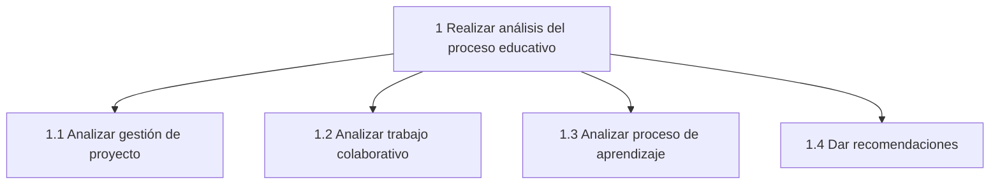
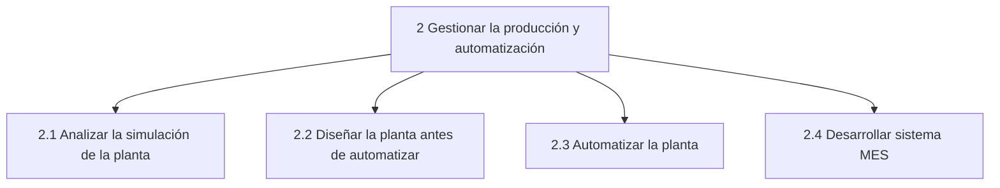
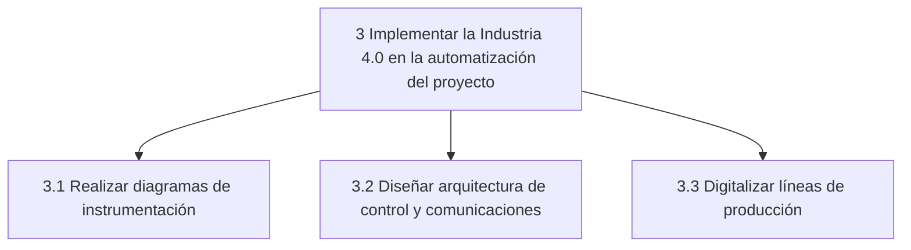
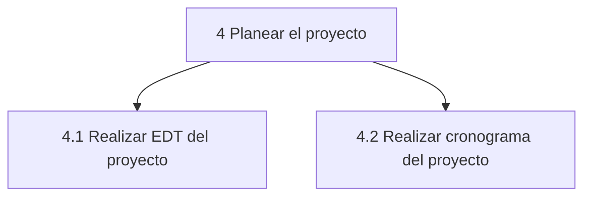
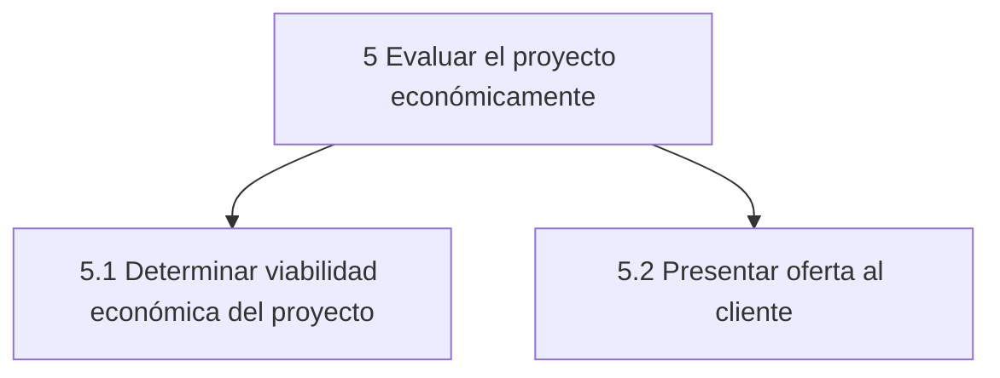
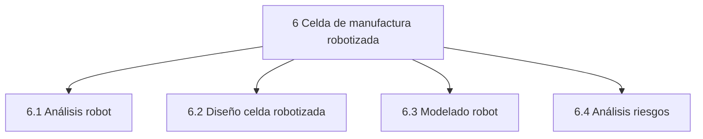
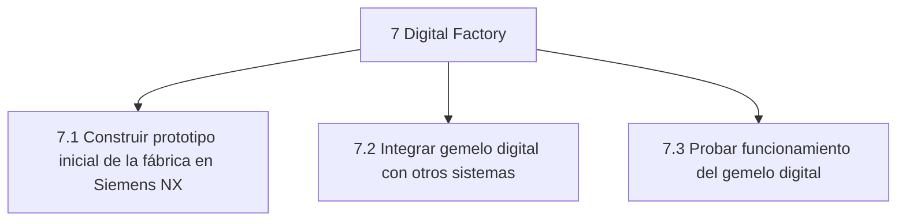
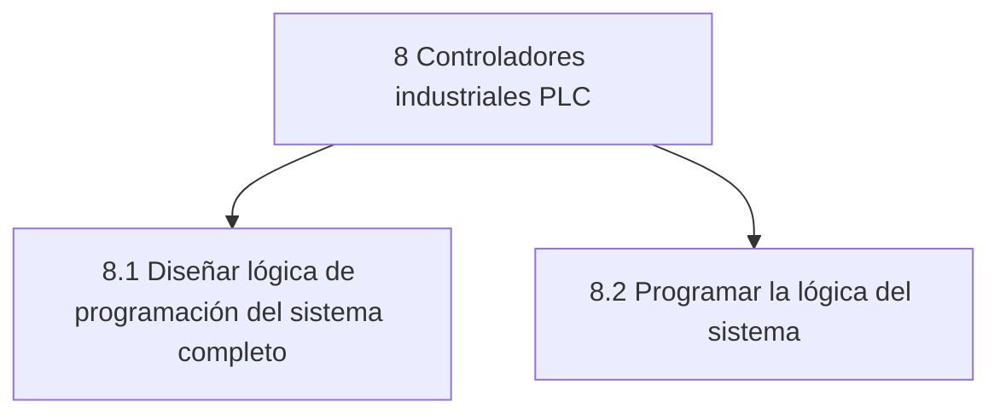
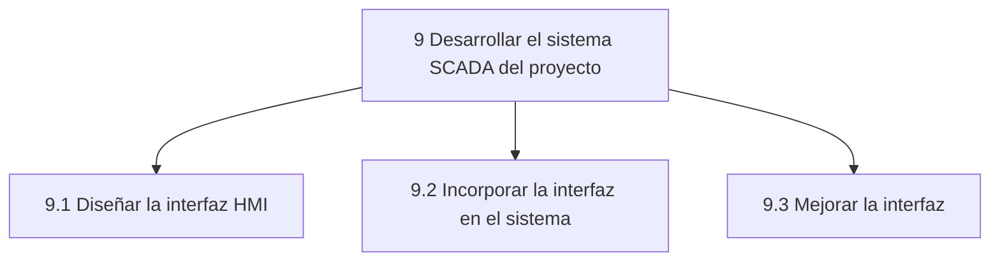

### Cronograma
El cronograma detallado se encuentra disponible [acá](Files/Cronograma.xlsx).
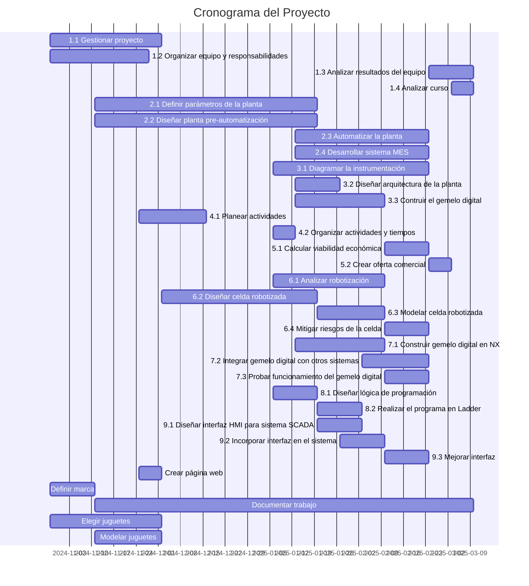
### Bitácoras

## Módulo 4: Evaluación Económica de Proyectos
### Economía del Proyecto
#### Presupuesto
#### Costos
#### Flujo de Caja
### Análisis rentabilidad
#### VPN
#### TIR
#### Payback
### Oferta comercial

## Módulo 5: Celda de Manufactura Robotizada
### Productos de entrada y salida de la celda

   

### Proceso de creación de la celda

 
La creación de la celda robotizada sigue una hoja de ruta estructurada que guía cada etapa del proceso, desde la orientación inicial hasta la validación final. Este diagrama de flujo detalla los pasos necesarios para analizar, diseñar, implementar y evaluar la celda, asegurando que cumpla con los objetivos del proyecto de manera eficiente y segura.

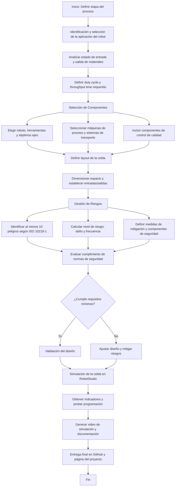

### Justificación y valor agregado

 La implementación de una celda robotizada para los procesos de empacado y paletizado se fundamenta en la necesidad de optimizar la eficiencia operativa, mejorar la calidad del producto final y garantizar la seguridad en las operaciones industriales. Este proyecto responde a diversos factores clave:

- **Incremento de la Productividad:** 

 La automatización de estos procesos permite aumentar significativamente la capacidad de producción al reducir los tiempos de ciclo, eliminar interrupciones innecesarias y minimizar el desperdicio de material. Las celdas robotizadas trabajan de manera continua, maximizando la utilización del tiempo y los recursos.

- **Mejora en la Precisión y Consistencia:** 

 Las tareas repetitivas como el empacado y el paletizado son propensas a errores cuando son realizadas manualmente. Con el uso de robots, se asegura una mayor precisión en la manipulación de productos y consistencia en la calidad del trabajo realizado.

- **Reducción de Costos Operativos:** 

 Aunque la inversión inicial para la adquisición y configuración de la celda robotizada puede ser significativa, se compensa a mediano y largo plazo mediante la reducción de costos asociados a errores humanos, horas extras y posibles mermas en el material.

- **Adaptabilidad y Flexibilidad:** 

 Las celdas robotizadas pueden ser programadas para manejar una amplia gama de productos y formatos, adaptándose a las necesidades cambiantes del mercado y permitiendo una rápida reconfiguración para nuevos procesos o productos.

- **Mejoras en la Seguridad Laboral:** 

 Al automatizar procesos que involucran levantamiento de cargas pesadas, movimientos repetitivos o condiciones potencialmente peligrosas, se reduce significativamente el riesgo de accidentes laborales y se mejora el bienestar de los empleados. Además, se evitan problemas de salud derivados de tareas repetitivas, como lesiones musculoesqueléticas, garantizando una mejor calidad de vida para los trabajadores.

- **Competitividad en el Mercado:** 

 La implementación de tecnologías avanzadas como la robótica industrial permite a la empresa mantenerse competitiva, respondiendo rápidamente a las demandas del mercado y cumpliendo con los estándares internacionales de calidad y eficiencia.

- **Sostenibilidad y Reducción del Impacto Ambiental:** 

 La automatización contribuye a una gestión más eficiente de los recursos, disminuyendo el desperdicio de materiales y optimizando el consumo energético, lo que se traduce en una menor huella ambiental.

### Diseño
#### Relación con el proceso de manufactura
#### Funcionalidad del robot

**Criterios de selección de los robots**
Los criterios utilizados se basaron en las necesidades específicas del proceso productivo, considerando el peso promedio de los juguetes y las dimensiones de los pallets.

***Capacidad de carga (Pay Load):***
- **Peso promedio del juguete:** 1,2 kg.
- Se seleccionaron robots con capacidad suficiente para manejar las cargas sin comprometer la velocidad ni precisión.

***Área de trabajo:***
- **Tamaño de los pallets:** 0,8 m x 1,2 m.
- Se seleccionaron robots con áreas de alcance adecuadas para cubrir el movimiento requerido en el proceso.

***Aplicación específica:***
- **Empaque:** Requiere alta velocidad y precisión para manejar objetos ligeros, ideal para el IRB 360.
- **Paletizado:** Requiere fuerza y un alcance mayor para manejar cajas y pallets completos, ideal para el IRB 1520.

**Características técnicas de los robots seleccionados**

***IRB 360 (Robot Delta):***

- **Carga útil máxima (Payload):** Hasta 3 kg.
- **Área de trabajo (Radio):** Hasta 1,6 m.
- **Repetibilidad:** ±0,1 mm.
- **Velocidad máxima:** Alta velocidad para aplicaciones de empaquetado rápido.
- **Aplicaciones:** Ideal para empaquetado, pick and place, y tareas de alta precisión.

***IRB 1520 (Robot Antropomorfico):***

- **Carga útil máxima (Payload):** Hasta 4 kg.
- **Área de trabajo (Alcance):** Hasta 1,8 m.
- **Repetibilidad:** ±0,1 mm.
- **Velocidad:** Optimizado para paletizado con ciclos rápidos y eficientes.
- **Aplicaciones:** Perfecto para manejar cajas y pallets en tareas de paletizado industrial.

***IRB 360 (Empacado):***
 - **Función principal:** Realiza tareas de empaquetado de juguetes en las líneas de producción, manipulando objetos individuales con alta velocidad y precisión.
 - **Justificación:** Diseñado para manejar cargas ligeras, como juguetes de 1,2 kg, con precisión y alta velocidad, ideal para procesos de empaque rápido.

  
  

***IRB 1520 (Paletizado):***
- **Función principal:** Encargado de paletizar cajas o productos terminados (juguetes ya empaquetados) en pallets de tamaño estándar de 0,8 m x 1,2 m.
- **Justificación:** Su capacidad de carga y área de trabajo lo convierten en la elección ideal para manipular pallets y organizar grandes volúmenes de productos.

  
   

#### Interacción con operarios

 La celda robotizada ha sido diseñada para trabajar de manera conjunta con el personal humano, maximizando la eficiencia del proceso y aprovechando las fortalezas tanto de la automatización como de las capacidades humanas. La interacción entre los robots y los operarios se desarrolla en las siguientes etapas:

**Preparación de Materiales**
- 
 Los operarios se encargan de cortar el plástico burbuja al tamaño adecuado, asegurando que cada juguete cuente con la protección necesaria antes de ser empacado.
- 
 Preparan y ensamblan las cajas, colocándolas listas para su llenado en la banda transportadora.

**Colocación y Disposición**
- 
 El personal dispone las cajas y el plástico burbuja sobre las bandas transportadoras para que los robots IRB 360 puedan proceder con la tarea de empacado.

**Supervisión de Operaciones**
- 
 Los operarios supervisan el funcionamiento de los robots, garantizando que las operaciones de empacado y paletizado se desarrollen sin interrupciones.
- 
 Pueden intervenir en caso de que surjan problemas, como obstrucciones en las bandas o fallos menores en el sistema.

**Sellado de Cajas**
- 
 Una vez que los robots han completado el empacado, el personal humano sella las cajas, asegurando que estén listas para su transporte y distribución.

**Soporte y Mantenimiento**
- 
 Los operarios están capacitados para realizar tareas básicas de mantenimiento preventivo en la celda, como limpieza, ajustes simples y monitoreo de los indicadores de desempeño de los robots.

**Colaboración en Seguridad**
- 
 El personal trabaja en conjunto con el sistema de seguridad de la celda, cumpliendo con los protocolos establecidos y verificando el correcto funcionamiento de las barreras de seguridad y sensores.

#### Análisis y gestión de riesgos

 En el desarrollo de la celda robotizada, es fundamental identificar y gestionar los posibles riesgos asociados a cada etapa del proceso. La siguiente tabla detalla las tareas principales, sub-tareas y los riesgos potenciales relacionados con el funcionamiento, mantenimiento y manejo de productos en la celda. Este análisis permite implementar medidas preventivas y protocolos de seguridad que garanticen un entorno de trabajo seguro y eficiente tanto para los operarios como para los equipos involucrados.

| **Tarea**                   | **Subtarea**                  | **Riesgo**                                                                                     | **ID** |
|-----------------------------|-------------------------------|------------------------------------------------------------------------------------------------|--------|
| **Funcionamiento**          | NA                            | Ingreso de personal en el área de los Robots.                                                     | R1     |
|                             | NA                            | Operarios interrumpiendo el camino de los Robots.                                                  | R2     |
|                             | NA                            | Los juguetes pueden caer por sujeción incorrecta del Robot.                                                | R3     |
|                             | Supervisión del proceso       | Fatiga visual o distracción del personal encargado de la monitorización de los procesos.                              | R4     |
|                             | Reabastecimiento de materiales | Contacto con partes móviles, riesgo de atrapamiento.                                           | R5    |
| **Mantenimiento**           | Ajuste o cambio del gripper   | Caída de objetos, puntos de atrapamiento, resbalones/tropiezos, superficies filosas.           | R6     |
|                             | Ajuste de rutina de robot     | Entrada a espacio confinado: equipo en movimiento, golpe por objetos, atrapamiento, aplastamiento. | R7     |
|                             | Cambio de batería de robot    | Contacto con electricidad, puntos de atrapamiento, superficies filosas.                       | R8     |
|                             | Limpieza de celda             | Puntos de atrapamiento, resbalones/tropiezos, superficies filosas, exposición a productos químicos. | R9     |
|                             | Verificación de sensores      | Contacto con partes móviles, riesgo de atrapamiento.                                          | R10    |
|                             | Inspección de piezas críticas | Lesiones por herramientas mal usadas o deterioradas, exposición a piezas filosas o cortantes. | R11    |
| **Entrada y salida del producto** | NA                     | Operarios interrumpiendo el espacio de trabajo de los Robots.                                                 | R12     |
|                             | Revisión de entrada/salida    | Desalineación de cajas o juguetes, riesgo de golpes o tropiezos.                              | R13    |
|                             | Manipulación manual           | Levantamiento inadecuado de cargas, riesgo de lesiones musculoesqueléticas.                   | R14    |
|                             | Control de flujo              | Atascos en bandas transportadoras, atrapamiento por correas.                                   | R15    |

 Como parte del diseño de la celda robotizada, se elaboró una matriz de riesgos siguiendo los lineamientos establecidos en la norma <strong>IEC 62061</strong>, que proporciona un marco para evaluar y gestionar los riesgos en sistemas de control eléctricos relacionados con la seguridad. Este análisis permitió comparar los niveles de riesgo antes y después de implementar medidas de mitigación.

 La matriz de riesgos se construyó identificando peligros potenciales, evaluando su probabilidad de ocurrencia y las posibles consecuencias, tanto en el estado inicial como tras aplicar las medidas de seguridad. Este enfoque sistemático asegura una reducción efectiva de los riesgos, priorizando la seguridad de los operarios y la funcionalidad confiable del sistema.

| **ID** | **Severidad (S)** | **Frecuencia (F)** | **Probabilidad (W)** | **Probabilidad de evitar o limitar daño (P)** | **Clase (K)** | **Clasificación de riesgo** |
|--------|--------------------|---------------------|-----------------------|-----------------------------------------------|---------------|-----------------------------|
| R1     | 4                  | 4                   | 4                     | 5                                             | 13            | SIL 3                       |
| R2     | 3                  | 5                   | 3                     | 5                                             | 13            | SIL 2                       |
| R3     | 4                  | 2                   | 3                     | 5                                             | 10            | SIL 2                       |
| R4     | 2                  | 2                   | 4                     | 4                                             | 10            | SIL 1                       |
| R5     | 4                  | 2                   | 3                     | 5                                             | 9             | SIL 1                       |
| R6     | 3                  | 1                   | 3                     | 5                                             | 9             | SIL 1                       |
| R7     | 4                  | 3                   | 3                     | 5                                             | 11            | SIL 3                       |
| R8     | 3                  | 5                   | 3                     | 5                                             | 13            | SIL 2                       |
| R9     | 4                  | 2                   | 3                     | 5                                             | 10            | SIL 2                       |
| R10    | 4                  | 3                   | 3                     | 5                                             | 11            | SIL 3                       |
| R11    | 4                  | 2                   | 3                     | 5                                             | 10            | SIL 2                       |
| R12    | 3                  | 5                   | 3                     | 5                                             | 13            | SIL 2                       |
| R13    | 3                  | 2                   | 3                     | 4                                             | 9             | SIL 1                       |
| R14    | 3                  | 2                   | 3                     | 4                                             | 9             | SIL 1                       |
| R15    | 4                  | 3                   | 3                     | 5                                             | 11            | SIL 3                       |

#### Seguridad

 Con el objetivo de garantizar un entorno de trabajo seguro y eficiente en la operación de la celda robotizada, se han diseñado e implementado una serie de acciones específicas para mitigar los riesgos identificados. Estas medidas no solo buscan prevenir incidentes, sino también promover la continuidad operativa, proteger a los operarios y optimizar el desempeño de los equipos. Las acciones planificadas incluyen:

| **ID** | **Actividades de mitigación**                                                                                                                                                  |
|--------|--------------------------------------------------------------------------------------------------------------------------------------------------------------------------------|
| R1     | Instalación de cortinas láser, instalación de mallas de celda, programación de la celda con interrupciones en las rutinas, botones de parada de emergencia, uso de EPP.        |
| R2     | Señalización del espacio de trabajo de cada uno de los robots, uso de EPP.                                                             |
| R3     | Uso de EPP, verificación continua de las condiciones del gripper.                                                                                                             |
| R4     | Creación de protocolos de seguridad para cambios de gripper, apagar todas las fuentes de energía de la celda durante el procedimiento, uso de EPP.                            |
| R5     | Verificación de las rutinas en simulación, no permitir el ingreso al área de trabajo durante la prueba de las rutinas, uso del teach pendant con dead man switch, uso de EPP. |
| R6     | Apagar todas las fuentes de energía del robot, uso de protecciones dieléctricas, uso de EPP.                                                                                  |
| R7     | Creación de protocolos de seguridad para limpieza de la celda, apagar todas las fuentes de energía de la celda durante el procedimiento, uso de EPP.                          |
| R8     | eñalización del espacio de trabajo de cada uno de los robots, uso de EPP.                                                             |
| R9     | Identificar y señalizar los puntos de atrapamiento, uso de guantes resistentes a químicos, protocolos para limpieza y manejo de productos químicos.                            |
| R10    | Apagar equipos antes de la verificación de sensores, uso de sistemas de bloqueo y etiquetado (LOTO), uso de EPP.                                                              |
| R11    | Inspección regular de herramientas, protocolos para el manejo seguro de piezas filosas, uso de guantes de protección.                                                         |
| R12    | Delimitar áreas de trabajo de robots, sistemas de monitoreo para detectar presencia humana, señalización adecuada, uso de EPP.                                                |
| R13    | Asegurar alineación de cajas o juguetes en bandas, protocolos para evitar tropiezos, mantenimiento preventivo de equipos.                                                     |
| R14    | Capacitación en levantamiento de cargas, uso de herramientas de asistencia ergonómica, pausas activas para evitar lesiones musculoesqueléticas.                                |
| R15    | Mantenimiento preventivo para evitar atascos, instalación de sistemas de parada automática en bandas transportadoras, señalización de zonas de riesgo.                        |

 Después de implementar las medidas de mitigación correspondientes, se elaboró una nueva matriz de riesgos actualizada. Esta matriz refleja la reducción en la probabilidad y/o severidad de los riesgos previamente identificados, demostrando la efectividad de las acciones correctivas aplicadas.

| **ID** | **Severidad (S)** | **Frecuencia (F)** | **Probabilidad (W)** | **Probabilidad evitar o limitar daño (P)** | **Clase (K)** | **Clasificación de riesgo** |
|--------|--------------------|---------------------|-----------------------|-------------------------------------------|---------------|-----------------------------|
| R1     | 4                  | 3                   | 2                     | 2                                         | 7             | SIL2                       |
| R2     | 3                  | 2                   | 2                     | 1                                         | 5             | OM                         |
| R3     | 4                  | 2                   | 3                     | 1                                         | 6             | SIL1                       |
| R4     | 2                  | 2                   | 3                     | 3                                         | 7             | N/A                        |
| R5     | 4                  | 2                   | 2                     | 2                                         | 7             | SIL1                       |
| R6     | 3                  | 1                   | 2                     | 2                                         | 5             | OM                         |
| R7     | 4                  | 3                   | 2                     | 2                                         | 7             | SIL2                       |
| R8     | 3                  | 2                   | 2                     | 1                                         | 5             | OM                         |
| R9     | 4                  | 2                   | 3                     | 2                                         | 7             | SIL2                       |
| R10    | 4                  | 3                   | 2                     | 2                                         | 7             | SIL2                       |
| R11    | 3                  | 2                   | 3                     | 1                                         | 6             | SIL2                       |
| R12    | 3                  | 2                   | 2                     | 1                                         | 5             | OM                         |
| R13    | 3                  | 2                   | 2                     | 1                                         | 5             | OM                         |
| R14    | 3                  | 2                   | 2                     | 1                                         | 5             | OM                         |
| R15    | 4                  | 3                   | 2                     | 2                                         | 7             | SIL2                       |

 Por último, se lleva a cabo una comparación detallada de las clasificaciones de riesgo antes y después de implementar las medidas de mitigación. Los resultados evidencian una disminución significativa en los niveles de riesgo identificados, lo que refleja la efectividad de las acciones correctivas y preventivas adoptadas. Este análisis no solo demuestra la mejora en la seguridad operativa, sino que también valida el enfoque estratégico utilizado para minimizar peligros, garantizando un entorno más seguro y eficiente para los operarios y el equipo.

| **ID** | **Clasificación de riesgo antes** | **Clasificación de riesgo después** |
|--------|-----------------------------------|-------------------------------------|
| R1     | SIL 3                             | SIL 2                               |
| R2     | SIL 2                             | OM                                  |
| R3     | SIL 2                             | SIL 1                               |
| R4     | SIL 1                             | N/A                                 |
| R5     | SIL 2                             | SIL 1                               |
| R6     | SIL 1                             | OM                                  |
| R7     | SIL 3                             | SIL 2                               |
| R8     | SIL 2                             | OM                                  |
| R9     | SIL 3                             | SIL 2                               |
| R10    | SIL 3                             | SIL 2                               |
| R11    | SIL 2                             | SIL 1                               |
| R12    | SIL 2                             | OM                                  |
| R13    | SIL 1                             | OM                                  |
| R14    | SIL 1                             | OM                                  |
| R15    | SIL 3                             | SIL 2                               |

#### Eleementos de Seguridad

# **Matriz de Riesgos (Basada en GUDELINE for Safeguarding Machinery and Equipment)**

| **Tarea**  | **Riesgo** | **Estimación del riesgo** | **Nivel** | **Método de reducción de riesgo** | **Equipo necesario** | **Imágen** |
|------------|-----------|---------------------------|-----------|------------------------------------|----------------------|-----------|
| **Funcionamiento del robot (Pick and Place y Paletizado)** | El robot podría moverse de manera inesperada y golpear a un operario. | - Seriedad: alta    - Frecuencia: media   - Difícil de evitar | D | Instalación de **barreras láser** que detengan el robot al detectar presencia en la zona de trabajo. | **Barreras láser de seguridad** |  |
| **Movimiento de objetos en el transportador** | Posible caída de productos por un mal posicionamiento del robot en Pick and Place. | - Seriedad: media    - Frecuencia: alta   - Fácil de evitar | C | Revisión continua del sistema de sujeción del robot y ajuste periódico de la presión del gripper. | **Sensores de presión en el gripper.** |  |
| **Señalización de estado de la celda** | Falta de advertencias visuales sobre el estado del proceso puede provocar accidentes. | - Seriedad: media    - Frecuencia: alta   - Difícil de evitar | C | Uso de **Industrial Tower Light** para indicar estados de peligro, alerta y operación normal. | **Industrial Tower Light.** |   |
| **Interacción con operarios en la estación manual de sellado** | Un operario podría ingresar accidentalmente al área de trabajo del robot. | - Seriedad: alta    - Frecuencia: baja   - Difícil de evitar | D | Instalación de **barreras físicas** y delimitación del área de trabajo del robot. | **Barreras físicas de protección.** |  |
| **Emergencias en la celda** | En caso de fallo del sistema, el operario podría no tener una forma rápida de detener el proceso. | - Seriedad: alta    - Frecuencia: baja   - Fácil de evitar | C | Implementación de **botones de parada de emergencia** en puntos estratégicos. | **Botón de parada de emergencia.** |  |
| **Zona de trabajo del operario** | Riesgo de tropiezos o resbalones en áreas críticas. | - Seriedad: media    - Frecuencia: media   - Fácil de evitar | C | Instalación de **Safety Mats** que detengan el robot si alguien pisa la zona de riesgo. | **Safety Mats (alfombras de seguridad).** |   |

**Explicación de la Matriz de Riesgos**
**Barreras láser:** Previenen el acceso no autorizado a la zona del robot.  
**Sensores en el gripper:** Aseguran una correcta sujeción de los productos en el Pick and Place.  
**Industrial Tower Light:** Proporciona alertas visuales sobre el estado del sistema.  
**Barreras físicas:** Evitan el ingreso involuntario a zonas de riesgo.  
**Botones de parada de emergencia:** Permiten detener la celda rápidamente en caso de problemas.  
**Safety Mats:** Detectan la presencia de un operario en zonas peligrosas y detienen el robot automáticamente.  

Este análisis garantiza un entorno de trabajo **seguro y eficiente**, protegiendo a los operarios mientras se mantiene un flujo óptimo en la celda robotizada.

### RobotStudio
#### Descripción del Layout

**1. Entrada de Cajas**
- Las cajas ingresan a la línea de producción a través de una banda transportadora.
- El flujo está marcado con flechas rojas indicando la dirección del movimiento.

**2. Entrada de Juguetes y Papel Panal**
- Los juguetes y el papel panal llegan desde líneas verticales a puntos de intersección con la banda principal.
- Estos materiales son manipulados por robots en los puntos señalados con líneas azules diagonales.

**3. Proceso de Empacado**
- Se observa la interacción de robots en la integración de juguetes y papel panal dentro de las cajas.
- La presencia de estos robots mejora la precisión y la velocidad del empacado.

**4. Estación Manual de Sellado**
- Después del empacado, las cajas se dirigen a una estación de sellado manual, identificada con color rosa.
- Aquí, los operarios sellan las cajas antes de continuar al proceso de almacenamiento y paletizado.

**5. Almacén de Producto en Proceso**
- Se encuentra identificado en color verde.
- Sirve como un área temporal antes de la siguiente fase del proceso.

**6. Proceso de Paletizado**
- Un robot, representado nuevamente con líneas diagonales azules, se encarga de organizar las cajas en pallets.
- La salida de los pallets está claramente definida con una flecha roja descendente.

**Características y Ventajas del Diseño**
**Flujo optimizado:** El diseño minimiza desplazamientos innecesarios y permite una transición eficiente entre las etapas.  
**Automatización con robots:** La manipulación de juguetes y papel panal por robots reduce errores y mejora la velocidad de empacado.  
**Interacción humana y robótica:** Se mantiene un equilibrio entre estaciones automatizadas y tareas manuales, como el sellado.  
**Claridad en las zonas de trabajo:** Las diferentes secciones están bien identificadas, lo que facilita la supervisión y el mantenimiento.  

Este diseño contribuye a la eficiencia de la celda de manufactura, asegurando un flujo de producción fluido desde la llegada de materiales hasta la salida de pallets listos para distribución.

**iagrama de Flujo**
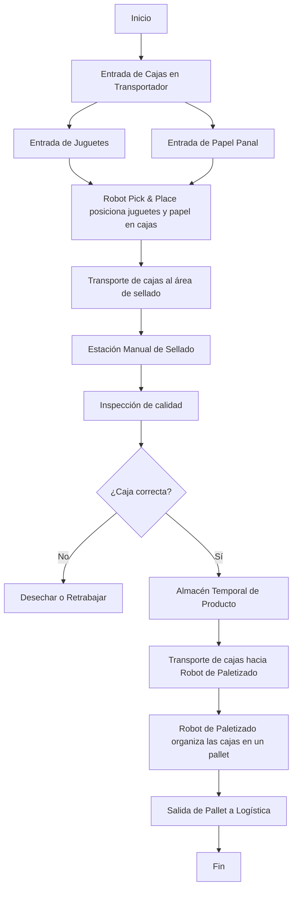

**1. Inicio del Proceso**
- Se introducen **cajas, juguetes y papel panal** en la celda a través de transportadores.

**2. Proceso de Empacado**
- Un **robot Pick & Place** posiciona juguetes y papel panal dentro de cada caja.
- Las cajas son transportadas automáticamente hacia la **estación de sellado**.

**3. Estación de Sellado e Inspección de Calidad**
- **Los operarios sellan las cajas manualmente**.
- Se realiza una **inspección de calidad** para verificar que el producto esté correctamente empaquetado.

**4. Rama de Decisión: ¿Caja correcta?**
- **Si la caja no cumple los estándares**, se **rechaza o se retrabaja** antes de continuar.
- **Si la caja está en buenas condiciones**, se **almacena temporalmente** antes del paletizado.

**5. Proceso de Paletizado**
- **El transportador lleva las cajas al robot de paletizado**.
- **El robot organiza las cajas en pallets** para su almacenamiento y distribución.

**6. Salida del Pallet a Logística**
- **El pallet es transportado fuera de la celda robotizada**, concluyendo el proceso.

**7. Fin del Proceso**
- **El ciclo finaliza cuando las cajas ya están listas para su distribución**.

#### Modelado

#### Programación
#### Simulación

## Módulo 6: Digital Factory
La implementación de una fábrica digital mediante el software NX de Siemens ha permitido modelar y simular procesos clave en la automatización de la planta de fabricación de juguetes de plástico. A través de esta herramienta, se han representado virtualmente los sistemas de producción, lo que permite analizar el desempeño de distintos componentes automatizados.
Dado los cambios sugeridos en la propuesta de automatización (compra de una máquina de pulido por vibración, instalación de una celda robotizada e instalación de un sistema de bandas transportadoras completamente automatizado), la fábrica digital desarrollada en Siemens NX incluye todas las etapas previas al inicio de la celda robotizada, ya que este proceso será simulado en RobotStudio. Para lograr una integración eficiente entre ambos softwares, se implementa la comunicación mediante un servidor OPC UA.
### Siemens NX
#### Entorno y modelamiento
Siguiendo el layout propuesto anteriormente en el software Tecnomatix, se implementaron las distintas estaciones que conforman el proceso de manufactura. Finalmente, la fábrica digital cuenta con las siguientes etapas y estaciones de producción:
- **Mezcla de plástico**  
- **Dosificación**  
- **Inyección**  
- **Desbarbado**  
- **Ensamble parcial**  
- **Ensamble final**  
- **Etapa de salida hacia la celda robótica**  

Además, se incluyen bandas transportadoras que funcionan como medio de transporte entre las distintas etapas.
#### Actuadores virtuales

* **Banda transportadora principal**  
  Se trata de una banda transportadora de 26 m de longitud y 0.6 m de ancho, encargada de conectar las bandas secundarias provenientes de cada una de las inyectoras y llevar las piezas hacia las estaciones de desbarbado. Se desplaza a una velocidad constante de 2 m/s y recibe una señal desde el PLC que permite encenderla o apagarla.
  

* **Bandas transportadoras secundarias**  
  Se implementaron un total de seis bandas transportadoras, divididas en dos grupos de tres. Cada una tiene dimensiones de 4.5 m de largo por 0.6 m de ancho. El primer grupo transporta las piezas desde las inyectoras hasta la banda principal, mientras que el segundo las traslada desde la banda principal hasta sus respectivas estaciones de desbarbado. Todas las bandas operan de manera continua a una velocidad de 2 m/s y reciben una señal del PLC que permite encenderlas o apagarlas.  

* **Cilindros neumáticos**  
  Su función es empujar las piezas transportadas por la banda principal hacia las distintas bandas secundarias, que luego las conducen a sus respectivas estaciones de desbarbado. En la simulación, estos cilindros se representan como una articulación prismática que recibe un número entero desde el PLC. Este número corresponde a la posición (expresada en milímetros) a la que debe desplazarse el cilindro. Una vez que las piezas han sido redirigidas a sus respectivas bandas secundarias, el cilindro regresa a su posición de origen para permitir el paso de las demás piezas que se desplazan a lo largo de la banda transportadora principal.
  

* **Actuadores angulares**  
  Estos actuadores bloquean el paso hacia la banda principal cuando se detectan piezas de un tipo diferente, evitando que sean enviadas a una estación de desbarbado incorrecta. En la simulación, su funcionamiento se representa mediante un número entero enviado desde el PLC, el cual indica la posición (expresada en grados) a la que debe desplazarse el actuador.
  

#### Sensores virtuales
* **Sensores infrarrojos**

   En simulación, se utilizan como sensores de colisión, permitiendo detectar si una pieza ha llegado a una posición determinada y, con base en ello, tomar una acción. En la fábrica digital, estos sensores permiten identificar si las piezas están próximas a ingresar a la banda principal o si se acercan a la banda secundaria, que las conducirá hacia la estación de desbarbado.
  

#### Simulación
Para la simulación en la fábrica digital de Siemens NX, se implementa la rutina utilizada en el arreglo de bandas automatizadas. De esta manera, es posible validar que los sensores, actuadores y la lógica de programación se integren correctamente, permitiendo que las piezas provenientes de las inyectoras lleguen a sus respectivas estaciones de desbarbado. Una vez en este punto, se simula el paso de las piezas por las distintas estaciones de ensamble hasta obtener un juguete completo, el cual continúa su recorrido por una banda transportadora que lo dirige hacia la celda robotizada, cuya simulación se realizará en RobotStudio.
## Módulo 7: Controladores industriales (PLC)
- Marco de IndDX, I4.0
- Progrmación Ladder & Grafcet
- Modos de Arranque/Parada (GEMMA)

- Spare del 20-30%: $Spare = \frac{\#I/O\ no\ usados}{\#I/O\ usados}$
### Selección de controladores
### Desglose de la lógica
#### Etapas
#### Transiciones
#### Modos
### Programación
#### Grafcet
#### Ladder
### Studio 5000
#### Programación e integración
#### Simulación

## Módulo 8: SCADA

### HMI

La interfaz gráfica del SCADA se diseñó en el software Ignition de Inductive Automation. La interfaz cuenta con 7 pestañas que permiten adquirir datos, supervisar, operar, historizar y alarmar.

#### Variables clave

Las principales variables que se tuvieron en cuenta para el SCADA corresponden a las cantidades procesadas en cada estación y al estado de operación de cada estación.

#### Diseño

En el diseño de utilizaron botones, labels, displays, switches toogle, gráficas, tablas de alarmas, símbolos de sensores.

#### Desarrollo

#### Validación
#### Elementos de alto desempeño
### Ignition
#### Integración control
#### Integración supervisión

# Resultados
## Resultados de aprendizaje
### Grupal
### Individual
Juan Andrés Barrera Rodríguez

El proyecto me permitió acercarme a distintos aspectos de lo que puede ser un proyecto de automatización a nivel industrial, dándome la oportunidad de conocer su alcance y los resultados que suelen esperarse en este tipo de iniciativas. Asimismo, considero que, si bien el desarrollo presentó desafíos en algunos aspectos técnicos, los resultados obtenidos fueron muy gratificantes. Esto se debe a que no son únicamente fruto del trabajo realizado durante el semestre, sino el resultado de varios años de aprendizaje de todos los integrantes del grupo, y no solo del mío.

Para el desarrollo del proyecto, la organización y el compromiso del equipo fueron fundamentales para alcanzar los resultados obtenidos. La adecuada distribución de tareas, la comunicación constante y la colaboración entre los integrantes permitieron superar los desafíos técnicos y cumplir con los objetivos planteados. Esta experiencia demuestra la importancia del trabajo en equipo en proyectos de automatización industrial, donde la integración de conocimientos y habilidades diversas es clave para lograr soluciones eficientes y funcionales.

El desarrollo de este proyecto me exigió poner en práctica muchas de las habilidades que he aprendido en los últimos años, además de enfrentarme a la necesidad de adquirir nuevos conocimientos para resolver los desafíos que surgieron en el proceso. Esta combinación de experiencia y aprendizaje continuo ha sido muy enriquecedora, y espero que las habilidades desarrolladas durante este proyecto me brinden un impulso y un valor diferencial en mi vida profesional, permitiéndome enfrentar con mayor confianza futuros retos en el ámbito de la automatización industrial.
## Resultados de ingeniería
### Resultados Módulo 1: Gestión de Producción y Automatización
### Resultados Módulo 2: Industria 4.0 en la Automatización
### Resultados Módulo 3: Planeación del Proyecto
### Resultados Módulo 4: Evaluación Económica de Proyectos
### Resultados Módulo 5: Celda de Manufactura Robotizada
### Resultados Módulo 6: Digital Factory
Este módulo nos presentó Siemens NX, una herramienta que hasta ahora no había sido muy utilizada por ninguno de los miembros del grupo. Por ello, fue necesario aprender a usar este software en paralelo al desarrollo del proyecto, lo que impidió profundizar en todas las funcionalidades que ofrece NX. Sin embargo, se logró explorar la librería Mechatronics Concept Designer (MCD), que resultó de gran utilidad para la implementación de la fábrica digital. MCD permitió crear un entorno virtual en el que sensores y actuadores pueden comunicarse con un controlador (PLC) virtual, con el fin de realizar pruebas de funcionamiento de la solución propuesta y así determinar su viabilidad.

Como resultado de este módulo, se obtuvo un gemelo digital de la fábrica, enfocado en la simulación del arreglo de bandas transportadoras que van desde las inyectoras hasta las estaciones de desbardado. Para lograr esto, se emplearon distintos tipos de sensores y actuadores, como sensores de colisión, cilindros neumáticos (representados como articulaciones prismáticas), actuadores angulares (representados como articulaciones rotacionales) y bandas transportadoras. Todo este sistema se conecta a un PLC virtual mediante un servidor OPC, permitiendo una interacción realista entre los componentes y facilitando la validación del funcionamiento de la solución propuesta.

Esta herramienta puede ser de gran importancia para futuros proyectos en entornos académicos o profesionales, ya que permite realizar distintos tipos de pruebas, simulaciones y análisis de procesos sin la necesidad de disponer físicamente de todos los elementos involucrados. Esto brinda una gran versatilidad para explorar nuevas soluciones, optimizar diseños y validar conceptos antes de su implementación real, lo que puede traducirse en ahorro de recursos y una mayor eficiencia en el desarrollo de proyectos de automatización.

### Resultados Módulo 7: Controladores industriales (PLC)
### Resultados Módulo 8: SCADA
