# Equipo: APM - ToyLab

- **Página web:** [APM ToyLab](https://apmtoylab.fcruzv.com/) FALTA: MODIFICAR FOTOS
- **Repositorio GitHub:** [GitHub - APMToyLab](https://github.com/SaraC27/APMToyLab)
- **Video presentación proyecto:** [Enlace Youtube]() (*no disponible aún*)

## Integrantes del equipo

- **Sara Valentina Cardona Mejía**
- **Juan Andrés Barrera Rodríguez**
- **Manuel Felipe Carranza Montenegro**
- **Felipe Cruz Vásquez**

# Tabla de Contenido

1. [Módulos](#módulos) 
   - [Módulo 1: Gestión de Producción y Automatización](#módulo-1-gestión-de-producción-y-automatización)  
     - [Pre-Automatización](#pre-automatización) MODIFICAR: J/S
       - [Indicadores](#indicadores)
       - [Tecnomatix](#tecnomatix)
       - [VSM](#vsm-pre)
     - [Post-Automatización](#post-automatización) MODIFICAR: J/S
       - [Indicadores](#indicadores-post)
       - [Tecnomatix](#tecnomatix-post)
       - [VSM](#vsm-post)
     - [Propuesta automatización](#propuesta-automatización) MODIFICAR: J/S
     - [Análisis de Mercado](#análisis-de-mercado) YA
     - [Sistema MES](#sistema-mes) YA

   - [Módulo 2: Industria 4.0 en la Automatización](#módulo-2-industria-40-en-la-automatización)  
     - [Pre-Automatización](#pre-automatización-40)  
       - [Diagramas P&ID](#diagramas-pid) FALTA: S
     - [Post-Automatización](#post-automatización-40)  
       - [Diagramas P&ID](#diagramas-pid-post) FALTA: S
       - [Diagrama Arquitectura / Tecnologías 4.0](#diagrama-arquitectura-post) YA
       
   - [Módulo 3: Planeación del Proyecto](#módulo-3-planeación-del-proyecto)  
     - [EDT](#edt) YA
     - [Cronograma](#cronograma) YA
     - [Bitácoras](#bitácoras) YA

   - [Módulo 4: Evaluación Económica de Proyectos](#módulo-4-evaluación-económica-de-proyectos)  FALTA: F (REVISAR ENTRE TODOS)
     - [Economía del Proyecto](#economía-del-proyecto) 
       - [Presupuesto](#presupuesto)  
       - [Costos](#costos)  
       - [Flujo de Caja](#flujo-de-caja)  
     - [Análisis rentabilidad](#análisis-rentabilidad)   
       - [VPN](#vpn)  
       - [TIR](#tir)  
       - [Payback](#payback)  
     - [Oferta comercial](#oferta-comercial)

   - [Módulo 5: Celda de Manufactura Robotizada](#módulo-5-celda-de-manufactura-robotizada) MODIFICAR: M  
     - [Justificación y valor agregado](#justificación-y-valor-agregado) 
     - [Diseño](#diseño)  
       - [Relación con el proceso de manufactura](#relación-con-el-proceso-de-manufactura)
       - [Funcionalidad del robot](#funcionalidad-del-robot) 
       - [Interacción con operarios](#interacción-con-operarios) 
       - [Análisis y gestión de riesgos](#análisis-y-gestión-de-riesgos) 
       - [Seguridad](#seguridad) 
     - [RobotStudio](#robotstudio)  
       - [Modelado](#modelado) 
       - [Programación](#programación)
       - [Simulación](#simulación)  

   - [Módulo 6: Digital Factory](#módulo-6-digital-factory) MODIFICAR: J 
     - [Siemens NX](#siemens-nx)  
       - [Entorno y modelamiento](#entorno-y-modelamiento)
       - [Actuadores virtuales](#actuadores-virtuales)
       - [Sensores virtuales](#sensores-virtuales)
       - [Simulación](#simulación-digital-factory)  

   - [Módulo 7: Controladores industriales (PLC)](#módulo-7-controladores-industriales-plc) FALTA: F
     - [Selección de controladores](#selección-de-controladores)  
     - [Desglose de la lógica](#desglose-de-la-lógica)
       - [Etapas](#etapas)
       - [Transiciones](#transiciones)
       - [Modos](#modos)
     - [Programación](#programación-plc)  
       - [Grafcet](#grafcet)  
       - [Ladder](#ladder)  
     - [Studio 5000](#studio-5000)  
       - [Programación e integración](#programación-e-integración)  
       - [Simulación](#simulación-plc)  

   - [Módulo 8: SCADA](#módulo-8-scada) FALTA: S 
     - [HMI](#hmi)  
       - [Variables clave](#variables-clave)  
       - [Diseño](#diseño-hmi)  
       - [Desarrollo](#desarrollo)  
       - [Validación](#validación)  
       - [Elementos de alto desempeño](#elementos-de-alto-desempeño)  
     - [Ignition](#ignition)  
       - [Integración control](#integración-control)  
       - [Integración supervisión](#integración-supervisión)  

2. [Resultados](#resultados) FALTA: TODOS  
   - [Resultados de aprendizaje](#resultados-de-aprendizaje)  
     - [Grupal](#grupal)  
     - [Individual](#individual)  
   - [Resultados de ingeniería](#resultados-de-ingeniería)  
     - [Módulo 1](#resultados-módulo-1)  
     - [Módulo 2](#resultados-módulo-2)  
     - [Módulo 3](#resultados-módulo-3)  
     - [Módulo 4](#resultados-módulo-4)  
     - [Módulo 5](#resultados-módulo-5)  
     - [Módulo 6](#resultados-módulo-6)  
     - [Módulo 7](#resultados-módulo-7)  
     - [Módulo 8](#resultados-módulo-8)  

# Módulos

## Módulo 1: Gestión de Producción y Automatización

Una fábrica de juguetes de plástico desempeña un papel crucial en la industria manufacturera y en la sociedad en general. Los juguetes no solo son herramientas esenciales para el entretenimiento infantil, sino también para el desarrollo cognitivo, emocional y social de los niños. Estos productos fomentan la creatividad, la imaginación y las habilidades motoras. 

Por esto mismo es fundamental que la planta cumpla con las demandas de producción establecidas para garantizar un suministro constante que satisfaga las necesidades del mercado. Asimismo, mantener las tecnologías actualizadas permite optimizar los procesos, reducir costos operativos y mejorar la eficiencia general. Esto no solo contribuye a la sostenibilidad al minimizar el impacto ambiental, sino que también refuerza la competitividad de la planta, asegurando su relevancia y capacidad para adaptarse a las exigencias de un mercado en constante evolución.

### Planta pre-automatización

Antes de implementar un proceso de automatización, es importante comprender las características fundamentales de la planta en su estado inicial. A continuación, se presentarán las características más relevantes de la planta, esenciales para identificar áreas de mejora y garantizar una transición eficiente hacia un modelo más avanzado.

La planta comprende un espacio total de **40x45 m** y tiene únicamente un nivel. Además de esto, cuenta con las siguientes etapas de manufactura que garantizan la producción de los juguetes de calidad que caracterizan a la empresa.

#### Etapas del proceso de manufactura

- Mezclado de plástico con pigmentos y aditivos según el color deseado (rojo y blanco).
- Dosificación de plástico en pequeñas cantidades, según la capacidad de las inyectoras de plástico.
- Inyección para formar las diferentes piezas, separadas en las siguientes categorías:
  - Detalles
  - Partes móviles
  - Cuerpos
- Uso de herramientas como escalpelo y soplete para retirar las rebabas de las piezas moldeadas.
- Ensamble parcial de cuerpos y detalles específicos de cada juguete.
- Ensamble parcial de piezas móviles, como ejes con ruedas o hélices.
- Ensamble final del producto.
- Empaque del juguete terminado en papel burbuja y cajas individuales.
- Paletizado de cajas con juguetes para transporte y distribución.

Los procesos de transporte entre las estaciones pueden variar y pueden ser tanto manuales como automáticos. Se darán más detalles en la sección donde se presenta el modelo de la planta.

### Value Stream Mapping (VSM)

Con el objetivo de identificar y visualizar de manera integral el flujo de materiales e información a lo largo del proceso de producción, se realiza un **VSM** de la planta mencionada anteriormente. Esta herramienta permite detectar ineficiencias, cuellos de botella y actividades que no generan valor, lo que resulta clave para diseñar estrategias de automatización en las estaciones. Así mismo, el VSM ayudará a identificar los distintos indicadores de producción que tiene actualmente la planta.

### Indicadores

Existen distintos indicadores en una planta de manufactura que permiten medir y evaluar el desempeño de los procesos operativos, productivos y estratégicos. A partir del análisis de los indicadores iniciales, se podrán identificar áreas de oportunidad y sugerir cambios específicos en la planta. Para este caso especifico se tendran en cuenta los siguientes indicadores.

- **Takt Time (T)**
- **Tiempo de ciclo (Tc)**
- **Tasa de producción (Rp)**
- **Capacidad de producción (Pc)**
- **Tiempo total de manufactura (MLT)**
- **Disponibilidad (A)**
- **Eficiencia (PE)**
- **Calidad (Q)**
- **Overall Equipment Effectiveness (OEE)**
- **Utilización (U)**

### Pre-Automatización
#### Indicadores

Consideraciones para el cálculo de indicadores  

- Se toma como referencia de producción la cantidad de juguetes vendidos en el año 2023 (30,794 juguetes en total).  
- Se supone que la producción anual se realiza de manera uniforme todas las semanas, es decir, que cada semana se produce la misma cantidad de juguetes (714 juguetes).  
- Se asume que la planta funciona durante 45 horas a la semana.  
- La distribución en la producción de juguetes es la siguiente:  
  - **Carros:** 60%  
  - **Aviones:** 20%  
  - **Submarinos:** 20%  
- Los desplazamientos realizados por operadores se suponen con una velocidad de **1.5 m/s**.  
- Los desplazamientos realizados por bandas transportadoras se suponen con una velocidad de **2 m/s**.  
- Se evalúa la producción semanal de la planta.  
- Se supone una calidad del **90%**, es decir, que el **10%** de los juguetes producidos tienen alguna imperfección.  
  
| **KPI**                               | **Descripción**                                                                 | **Valor**                             |
|----------------------------------------|---------------------------------------------------------------------------------|---------------------------------------|
| **Takt Time (T)**                      | Cadencia con la que se debe fabricar el producto para satisfacer la demanda     | 3.78 min/juguete                      |
| **Tiempo de ciclo (Tc)**               | Tiempo de proceso                                              | 3,16 min |
| **Tasa de producción (Rp)**            | Número de partes producidas por hora                                           | 18 juguetes/hora                     |
| **Capacidad de producción (Pc)**       | Máxima tasa de salida que la fábrica puede alcanzar                            | 838 juguetes/semana                   |
| **Tiempo total de manufactura (MLT)**  | Tiempo desde la orden de producción hasta la finalización del lote (143 juguetes)             | 7,67 horas                          |
| **Disponibilidad (A)**                 | Disponibilidad de las máquinas                                                 | 80 %                                 |
| **Eficiencia**                         | Eficiencia de desempeño                                                         | 70 %                                 |
| **Calidad**                            | Porcentaje de producto defectuoso                                              | 90 %                                 |
| **Overall Equipment Effectiveness (OEE)** | Indicador general de desempeño                                            | 50 %                                 |
| **Utilización (U)**                    | Porcentaje de tiempo en que la fábrica está operativa                          | 85,26 %   |

Ademas de esto, se uso el software Tecnomatix para validar la exactidud de los indicadores calculados. Especificamente de la eficiencia y del OEE

| Métrica       | Calculado | Simulación |
|--------------|-----------|------------|
| **Eficiencia** | 67%       | 70%        |
| **OEE**       | 48%       | 50%        |

A partir de lo anterior se observa que los valores calculados no difieren mucho de los valores obtenidos en simulacion, por esto mismo se considera que los indicadores calculados tienen valores que se acercan a los de la simulacion y se consideran como datos validos para tomar de referencia.

#### Tecnomatix

El diseño inicial de la planta pre-automatizada se llevó a cabo en el software de fabricación digital Tecnomatix Plant Simulation de Siemens (como se evidencia en la imagen a continuación), debido a que este software permitió la simulación de las diferentes etapas del proceso de manufactura incluyendo, asimismo, los tiempos de proceso de cada una de las máquinas. Esto último facilitó observar información relevante para calcular el OEE.

#### VSM Pre

La informacion detallada del diagrama VSM de la planta antes de la automatización se puede encontrar en el siguiente [enlace](Files/VSM_Pre.pdf).

### Post-Automatización

#### Indicadores

Luego de implementar la propuesta de automatizacion se espera obtener los siguientes KPI. Para obtener informacion mas detallada sobre el calculo de los mismos, remitirse al siguiente [archivo](Files/Indicadores_Post.xlsx).
Consideraciones para el cálculo de indicadores  

- Se toma realiza una predicción de la demanda de juguetes de los próximos años, ya que el proyecto esta previsto para 5 años se usan las predicciones de demana del año 2029 para determinar la producción que debe cumplir la planta automatizada (55,327 juguetes en total).  
- Se supone que la producción anual se realiza de manera uniforme todas las semanas, es decir, que cada semana se produce la misma cantidad de juguetes (1154 juguetes).  
- Se asume que la planta funciona durante 45 horas a la semana.  
- La distribución en la producción de juguetes es la siguiente:  
  - **Carros:** 60%  
  - **Aviones:** 20%  
  - **Submarinos:** 20%  
- Los desplazamientos realizados por operadores se suponen con una velocidad de **1.5 m/s**.  
- Los desplazamientos realizados por bandas transportadoras se suponen con una velocidad de **2 m/s**.  
- Se evalúa la producción semanal de la planta.  
- Se supone una calidad del **90%**, es decir, que el **10%** de los juguetes producidos tienen alguna imperfección.
  
| **KPI**                               | **Descripción**                                                                 | **Valor**                             |
|----------------------------------------|---------------------------------------------------------------------------------|---------------------------------------|
| **Takt Time (T)**                      | Cadencia con la que se debe fabricar el producto para satisfacer la demanda     | 2,34 min/juguete                      |
| **Tiempo de ciclo (Tc)**               | Tiempo de proceso                                              | 2,28 min |
| **Tasa de producción (Rp)**            | Número de partes producidas por hora                                           | 25 juguetes/hora                     |
| **Capacidad de producción (Pc)**       | Máxima tasa de salida que la fábrica puede alcanzar                            | 1157 juguetes/semana                   |
| **Tiempo total de manufactura (MLT)**  | Tiempo desde la orden de producción hasta la finalización del lote (231 juguetes)             | 8,98 horas                          |
| **Disponibilidad (A)**                 | Disponibilidad de las máquinas                                                 | 88 %                                 |
| **Eficiencia**                         | Eficiencia de desempeño                                                         | 71 %                                 |
| **Calidad**                            | Porcentaje de producto defectuoso                                              | 90 %                                 |
| **Overall Equipment Effectiveness (OEE)** | Indicador general de desempeño                                            | 57 %                                 |
| **Utilización (U)**                    | Porcentaje de tiempo en que la fábrica está operativa                          | 61,78 %   |

Además de esto, se usó el software Tecnomatix para validar la exactidud de los indicadores calculados. Específicamente de la eficiencia y del OEE, aquí se pudo observar que:

| Métrica       | Calculado | Simulación |
|--------------|-----------|------------|
| **Eficiencia** | 68%       | 72%        |
| **OEE**       | 54%       | 57%        |

A partir de lo anterior se observa que los valores calculados no difieren mucho de los valores obtenidos en simulación, por esto mismo se considera que los indicadores calculados tienen valores que se acercan a los de la simulación y se consideran como datos válidos para tomar de referencia.

#### Tecnomatix

Al igual que el diseño de la planta antes de la automatización, el modelado de la planta automatizada se desarrolló en Tecnomatix Plant Simulation, aprovechando las opciones que este software ofrece como, por ejemplo, robots de pick and place. Igualmente, se configuraron los tiempos correspondientes en las máquinas y se obtuvo información del proceso para el cálculo del OEE.

Luego de implementar la simulación, se observaron algunos cambios significativos en ciertas estaciones. En particular, en la estación de empaquetado, se evidenció que el tiempo de espera disminuyó en un 20% en la planta automatizada, lo cual indica que la implementación de la celda robotizada cumple su función.

#### VSM Post

Con la implementación de la propuesta de automatización se espera obtener el siguiente [VSM](Files/VSM_Post.pdf).

### Propuesta automatización

Se propone implementar un plan de automatización en la planta, enfocado en optimizar tres zonas clave del proceso de producción. A continuación, se detalla la propuesta para cada una de estas áreas:

#### Transporte de piezas desde las inyectoras hasta las estaciones de desbarbado:

Actualmente, las piezas que salen de las inyectoras son transportadas a través de un sistema de bandas transportadoras hasta un almacén intermedio. Desde allí, un operario las recoge manualmente y las lleva a sus respectivas estaciones de desbarbado. Este proceso toma un total de 28 segundos, distribuidos de la siguiente manera: 10 segundos en el sistema de bandas transportadoras y 18 segundos en el traslado manual realizado por el operario.

Para optimizar este flujo, se propone complementar el sistema existente de bandas transportadoras mediante la instalación de un nuevo conjunto de bandas. Este nuevo sistema permitirá que las piezas sean transportadas directamente desde las inyectoras hasta sus estaciones correspondientes de desbarbado, eliminando la necesidad del almacenamiento intermedio y el transporte manual.

Con esta mejora, el tiempo total de transporte se reduciría a 15 segundos: 10 segundos en el sistema de bandas original y 5 segundos en el nuevo sistema. Además, esta automatización liberará al operario, quien podrá ser reubicado en otra estación donde sea más necesario, optimizando el uso de los recursos humanos.

#### Corte de la ejes de acero inoxidable:

Actualmente, los ejes de acero inoxidable que salen del proceso de corte láser son sometidos a un pulido manual. Este proceso requiere que un operario pula cada eje individualmente utilizando una esmeriladora de banco, con un tiempo promedio de 10 segundos por eje.

Para optimizar este procedimiento, se propone implementar una máquina de acabado por vibración que permita procesar múltiples ejes de manera simultánea, eliminando la necesidad de realizar el pulido manual uno a uno.

Con esta mejora, el tiempo de pulido por eje se reduciría drásticamente a 3,75 segundos, lo que representa una optimización significativa del proceso. Además, el operario sería liberado de esta tarea repetitiva, pasando a desempeñar labores de supervisión de la máquina de de acabado por vibración, lo que incrementa la eficiencia general del área y mejora la ergonomía del trabajo.

#### Empacado y paletizado:

Actualmente, el proceso de empacado y paletizado de los juguetes se realiza de manera manual por operarios. En la etapa de empacado, que incluye envolver cada juguete en plástico burbuja y colocarlo dentro de una caja de cartón, el tiempo requerido por juguete es de 60 segundos. Por otro lado, el proceso de paletizado, también manual, toma 15 segundos adicionales por juguete.

Para optimizar este flujo, se propone la implementación de una celda robotizada que realice ambas tareas de manera automática, eliminando la necesidad de que los operarios las ejecuten manualmente uno por uno.

Con esta mejora, el tiempo necesario para el empacado se reduciría a 10 segundos por juguete, mientras que el tiempo de paletizado disminuiría a 5 segundos. Esto no solo incrementaría la eficiencia y productividad del proceso, sino que también liberaría a los operarios de estas tareas repetitivas, permitiéndoles asumir funciones de supervisión de la celda robotizada, mejorando así el aprovechamiento de los recursos humanos.

#### Comparación entre la planta PRE y POST Automatización:

   
   

### Análisis de Mercado
Para saber cuántos juguetes deben producirse (gestión de la producción), se realizó el siguiente paso a paso para obtener un estimado de la demanda de juguetes en Colombia.

1. Se descargaron datos de los últimos `5` años de la `DIAN`. [Link DIAN](https://www.dian.gov.co/dian/cifras/Paginas/TributosDIAN.aspx)
2. Se revisó la información para la actividad económica: `Fabricación de juegos, juguetes y rompecabezas`.
3. En base al `número de responsables`, `total de ingresos brutos` y `total anticipos de IVA por bimestre`, se obtuvo la sigueinte gráfica, suponiendo que $\frac{1}{3}$ del total de la actividad económica corresponde a juguetes:

*Eje vertical en millones de pesos colombianos*

4. Estimamos el promedio de acaparación de mercado para una empresa/fábrica de juguetes en Colombia: $Acaparación=\frac{1}{número\ de\ competidores}\approx0.7%$.
5. Supusimos una fábrica promedio, con lo cual se obtiene la siguiente gráfica para los ingresos de la misma:

*Eje vertical en millones de pesos colombianos*

6. Supusimos un precio de venta de los juguetes de $1.5$ veces su costo.
7. Modelamos cuántos juguetes de cada tipo hay que fabricar y vender para llegar a los ingresos estimados. Para esto, se tiene $total\ juguetes\ tipo\ i = precio\ de\ un\ juguete\ tipo\ i* \frac{ingresos\ esperados\ totales}{porcentaje\ de\ ingresos\ que\ suple\ juguete\ tipo\ i}$.
8. Calculamos cuántos juguetes de cada tipo se deben producir. Se ajustó el `porcentaje de ingresos que suple juguete tipo i` para que la cantidad de juguetes a producir de cada tipo fuera similar y se obtuvo la siguiente gráfica de producción:

*La gráfica tiene picos en las fechas donde se celebra el día del niño y Navidad. Lo cual sirve de validación para el estimado realizado.*

9. Se ajustó la gráfica para que se tuviera producción mensual en vez de bimestral (suponiendo que en los dos meses de un bimestre se produce la misma cantidad de juguetes), y se obtuvo la gráfica:

10. Para estimar la producción esperada gracias a la automatización de la planta. Supusimos que se quiere acaparar el `2.5%` del mercaado en vez del `0.7%` y que, además, se logra cumplir con el crecimiento de la industria (ya que, mes a mes, se ve una tendencia creciente durante los últimos 5 años).
11. Se realizó una regresión lineal para extrapolar los datos hasta el año `2029` (5 años hacia el futuro), y se obtuvo la siguiente gráfica:

12. Finalmente, la gráfica de demanda de juguetes estimada para el proyecto corresponde con:
   - Los datos iniciales estimados para una empresa promedio (acaparación del `0.7%`) en Colombia (antes de automatizar) durante los primeros 5 años.
   - Los datos extrapolados para una empresa que acapara el `2.5%` del mercado en Colombia (después de automatizar) durante los próximos 5 años.

El archivo [Analisis_Mercado.xlsx](Files/Analisis_Mercado.xlsx) se puede usar para generar las gráficas, cambiar estimados y suposiciones.

### Sistema MES

El sistema MES propuesto consta de una aplicación Web conectada a la arquitectura que se presenta más adelante en la sección [Diagrama Arquitectura / Tecnologías 4.0](#diagrama-arquitectura-post). El sistema MES cuenta con acceso a la base de datos que conecta los diferentes módulos/sistemas donde se registran valores históricos relacionados con la producción, operación y supervisión de la planta. **Los datos presentados en el sistema MES se actualizan cada minuto.**

#### Módulo de indicadores
El sistema MES cuenta con un módulo para el cálculo de indicadores.

Indicadores:
- Ocupación
- Eficiencia
- Disponibilidad
- Calidad
- OEE

*Nota: Más detalle sobre los indicadores en la sección [Gestión de producción y automatización](#diagrama-arquitectura-post)*.

Funciones:
- Visualizar los indicadores calculados con los datos.

*Nota: Los datos presentados en la imagen no son reales y se colocaron con fines netamente ilustrativos.*

#### Módulo de gestión de producción
El sistema MES cuenta con un módulo para la supervisión y control de la producción.

Funciones:
- Definir objetivo de producción para cada tipo de juguete.
- Visualizar cuántos juguetes de cada tipo se han producido.
- Visualizar serie de tiempo de la producción real y la producción objetivo (permite filtrar por tipo de juguete).

*Nota: Los datos presentados en la imagen no son reales y se colocaron con fines netamente ilustrativos.*

#### Módulo de supervisión
El sistema MES cuenta con un módulo para la supervisión del estado de las secciones más importantes de la planta.

Secciones importantes de la planta:
- **Inyectora A:** Cuenta con una inyectora, una banda y una compuerta.
- **Inyectora B:** Cuenta con una inyectora, una banda y una compuerta.
- **Inyectora C:** Cuenta con una inyectora, una banda y una compuerta.
- **Estación A:** Cuenta con una compuerta, una banda y una zona de almacenamiento.
- **Estación B:** Cuenta con una compuerta, una banda y una zona de almacenamiento.
- **Estación C:** Cuenta con una compuerta, una banda y una zona de almacenamiento.
- **Celda robotizada:** Cuenta con 3 robots, una mesa de trabajo y varias bandas.
- **Banda Principal:** Es la banda principal de la planta por la que toda pieza fabricada por inyección debe pasar.

Funciones:
- Visualizar el estado actual de cada sección importante de la planta.
- Visualizar el porcentaje de tiempo que cada sección ha estado en cada estado (a partir del histórico).

Estados posibles para cada sección:
- **Offline:** No hay conexión de la sección con el sistema, no se recibe información.
- **Stop:** La sección se encuentra detenida, no realiza sus tareas.
- **Funcionando:** La sección se encuentra funcionando correctamente, realiza sus tareas de producción.
- **Mantenimiento:** La sección se encuentra en mantenimiento.
- **Falla:** La sección presenta una falla que requiere atención.
- **Setup:** La sección se encuentra en proceso de acondicionamiento para producir un juguete de un tipo específico.

*Nota: Los datos presentados en la imagen no son reales y se colocaron con fines netamente ilustrativos.*

## Módulo 2: Industria 4.0 en la Automatización
### Pre-Automatización

#### Diagrama P&ID

El diagrama PI&D de la planta pre-automatizada, que se observa en la siguiente imagen, se desarrolló haciendo uso del programa drawio. Cabe resaltar que en esta planta no se cuenta con sensores y la mayoría se procesos se ejecutan de forma manual.
A continuación se especifican los modos de operación de cada estación.

| **Estación**             | **Modo de operación** |
| :---: | :---: |
| Mezcladoras              | Manual                |
| Dosificadoras            | Manual                |
| Inyectoras               | Automático            |
| Bandas transportadoras   | Automático            |
| Desbarbado               | Manual                |
| Ensambles                | Manual                |
| Empaquetado              | Manual                |
| Paletizado               | Manual                |

### Post-Automatización

#### Diagrama P&ID

El diagrama P&ID de la planta automatizada también se graficó en drawio. Esta planta ya cuenta con sensores y actuadores, como se evidencia en la siguiente imagen, y aumentó la cantidad de procesos que se ejecutan de forma automática.
A continuación se especifican los modos de operación de cada estación y las convenciones.

| **Estación**             | **Modo de operación** |
| :---: | :---: |
| Mezcladoras              | Manual                |
| Dosificadoras            | Manual                |
| Inyectoras               | Automático            |
| Bandas transportadoras   | Automático            |
| Desbarbado               | Manual                |
| Ensambles                | Manual                |
| Empaquetado              | Automático            |
| Paletizado               | Automático            |

| **Símbolo**             | **Modo de operación** |
| :---: | :---: |
| Sensor "IQI"            | Sensor "Infrared Quantity Indicator" |
| Línea "-----"           | Señal eléctrica                      |

### Arquitectura y Tecnologías 4.0

La arquitectura implementada para el sistema se presenta a continuación:

La arquitectura se despliega en la nube de `AWS`, donde se cuenta con una base de datos `NoSQL`, un sistema de autenticación y funciones que se pueden acceder/ejecutar a través de una `API`. La integración de las diferentes tecnologías se realiza mediante esta API, que funge como punto común para escribir y leer datos del sistema. Cada tecnología utilizada debe exponer su información de lectura y escritura, mediante un servidor `OPC` alojado en el software `Ignition`, para posteriormente enviarla/recibirla mediante nodos `HTTPS` dentro de `NodeRed`, los cuales se conectan con la API en AWS. Además, la página web del proyecto (realizada con `React`) cuenta con un módulo para la utilización de la `API` (Application Programming Interface).

#### Características de la arquitectura

**Tecnologías utilizadas**
- *Siemens NX:* Implementación del gemelo digital de la planta.
- *Studio 5000:* Implementación de la lógica en lenguaje de programación Ladder.
- *RSLinx:* Emulador de PLC para ejecución del código en Ladder.
- *RobotStudio:* Implementación de la celda robotizada que forma parte de la planta (parte del gemelo digital).
- *Google Chrome:* Navegador web para el alojamiento de los dashboard SCADA y el sistema MES.
- *AWS - Api Gateway:* Servicio en la nube de AWS para la implementación de APIs públicas, es como un servidor HTTPS.
- *AWS - Lambda:*  Servicio en la nube de AWS para la implementación de funciones de código, se encarga de utilizar otros servicios para autenticar usuarios, leer y escribir en la base de datos y procesar las peticiones de la API.
- *AWS - DynamoDB:* Servicio en la nube de AWS para almacenamiento de datos en una base de datos NoSQL, donde se guardará un registro para la comunicación en tiempo real entre los nodos del sistema, y se almacenará una copia de dicho registro cada 5 segundos para tener un histórico.
- *AWS - Cognito:* Servicio en la nube de AWS para el registro y posterior autenticación de usuarios, donde se generan tokens `JWT` para autenticar y proteger las comunicaciones con la API.
- *React:* Framework de desarrollo de aplicaciones web, donde se utiliza la API para colocar el sistema MES.
- *Ignition:* Software que permite la comunicación de datos entre diferentes tecnologías y otros servicios de conexión a internet como NodeRed. También, permite la creación de Dashboards SCADA para el sistema.
- *Node Red:* Software de configuración de red sobre el cual se monta una lógica de lectura y escritura de datos entre Ignition y la API del sistema.

**Protocolos de comunicación:**
- *OPC (Open Platform Comunications)*: Permite la comunicación de información entre diferentes tecnologías.
- *Ignition Node:* Para comunicar la información disponible en el servidor OPC con la API en la nube, se requiere de un nodo dentro de Node Red llamado `node-red-contrib-ignition-nodes`.
- *HTTP (Hyper Text Transfer Protocol):* Protocolo de comunicación web para el envío de información. Al ser un protocolo no seguro (no va encriptado), solamente se utiliza para envío de información con servidores locales.
- *HTTPS (Hyper Text Transfer Protocol Secured):* Protocolo de comunicación web para el envío de información encriptada por internet, utilizado para la comunicación bidireccional con la API. Mencionar que la API se propone con funcionalidad `WebSocket` para una comunicación fluida y en tiempo real. Sin embargo, por costos reales de la utilización de la nube AWS, montamos la simulación sobre una `API` tipo `request - response` para que fuera menos costoso (lo cual generó delay entre las comunicaciones, pero lo ideal sería utilizar `WebSocket` para reducir el delay).
- *API AWS:* Conjunto de funciones/protocolos/reglas que AWS dispone para la utilización de sus servicios dentro de la nube AWS.

#### Nodos de la arquitectura y relación con la pirámide de automatización

La pirámide de automatización es un estándar que consta de 5 niveles:
- **Planta:** Sensores, Actuadores.
- **Control:** PLC, PAC, DCS
- **SCADA:** Supervisión, Operación, Adquisición de datos, Alarmas, Históricos.
- **MES:** Gestión de la producción.
- **ERP:** Gestión empresarial.

*Pirámide de Automatización. [Fuente](https://www.seika.com.mx/5-niveles-de-la-automatizacion-industrial/)*

Esta perspectiva se basa en una comunicación vertical entre los niveles. Para la implementación de la `Industria 4.0` se busca horizontalizar la pirámide al permitir la comunicación de todas las etapas hacia un sistema centralizado (`nube`) que gestione y almacene los datos de cada nivel y los comunique a cualquiera de los otros niveles sin tener que pasar estrictamente por cada nivel intermedio.

En nuestra arquitectura se presenta cada uno de los niveles mediante cada uno de los 6 nodos del diagrama de arquitectura:
- **Planta:** Es el nodo del `Gemelo Digital` (Siemens NX) y el nodo de la `Celda Robotizada` (RobotStudio). Mediante `Ignition + Node Red`, envía valores de los sensores digitales y recibe acciones para los actuadores digitales, a través del sistema AWS para una arquitectura de Industria 4.0.
- **Control:** Es el nodo del `PLC` (RSLinx + Studio 5000). Mediante `Ignition + Node Red`, recibe valores de los sensores digitales y acciones del sistema SCADA; y envía acciones para los actuadores digitales, a través del sistema AWS para una arquitectura de Industria 4.0.
- **SCADA:** Es el nodo del `SCADA` (Ignition + Navegador Web). Mediante `Ignition + Node Red`, recibe valores de los sensores digitales y estados generales del sistema; y envía acciones para los actuadores digitales y variables globales de proceso, a través del sistema AWS para una arquitectura de Industria 4.0.
- **MES + ERP:** Es el nodo del `Sistema MES` (React + Navegador Web). Mediante `HTTPS`, recibe valores de producción y estados generales del sistema; y envía variables globales de proceso, a través del sistema AWS para una arquitectura de Industria 4.0.
- **Nube:** Es el nodo de `AWS` (API + Base de datos + Autenticación). Mediante `HTTPS`, recibe y envía valores de todos los otros nodos/niveles del sistema, siendo la pieza central para lograr una arquitectura de Industria 4.0.

La arquitectura propuesta es `ESCALABLE`. Al tener el sistema centralizado en `AWS`, se pueden interconectar nuevos servicios como `Análisis de datos`, `Inteligencia artificial`, `etc` y nuevas funciones de la `API` como `Registro de ventas`, `Registro de inventario`, `etc`. Y utilizar toda la información disponible para tomar decisiones más rápidas que interfieren directamente con el proceso real de la planta.

## Módulo 3: Planeación del Proyecto
### EDT
El EDT detallado se encuentra disponible [acá](Files/EDT.xlsx).
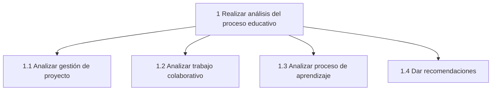
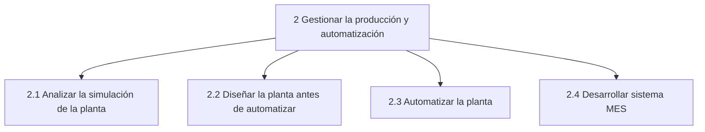
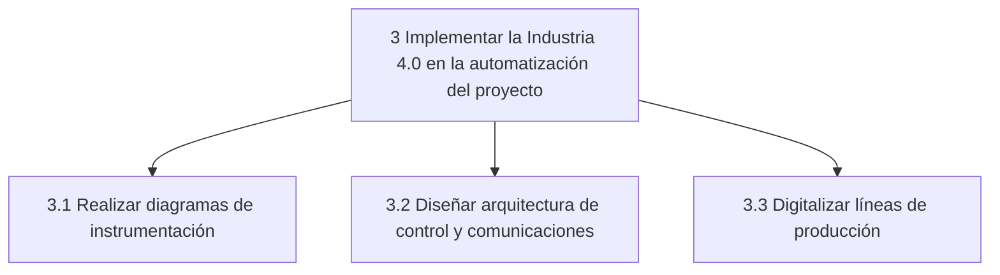
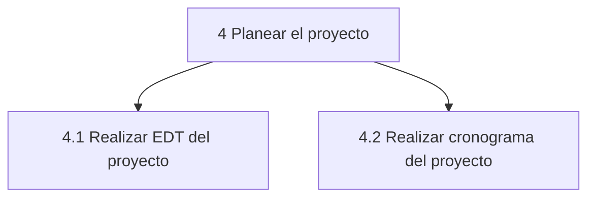
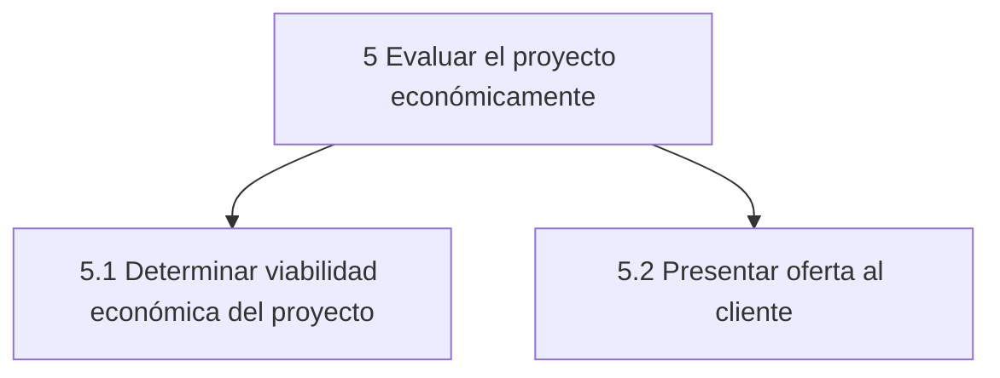
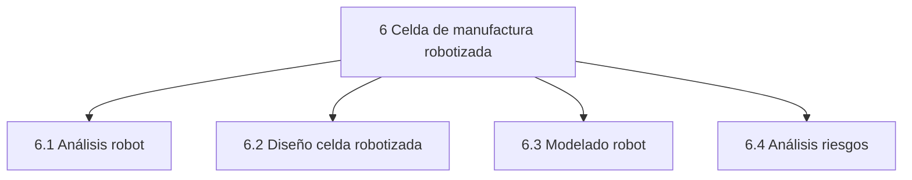
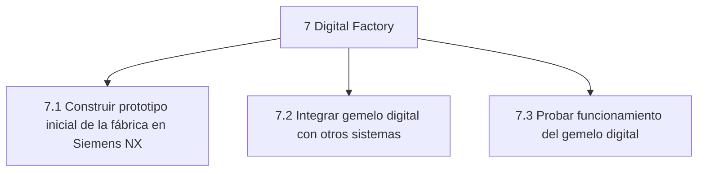
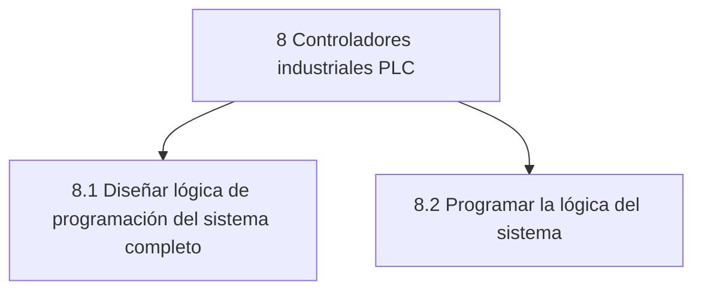
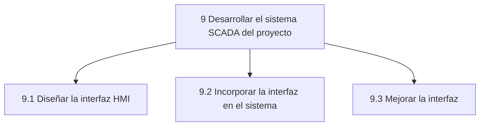

### Cronograma
El cronograma detallado se encuentra disponible [acá](Files/Cronograma.xlsx).
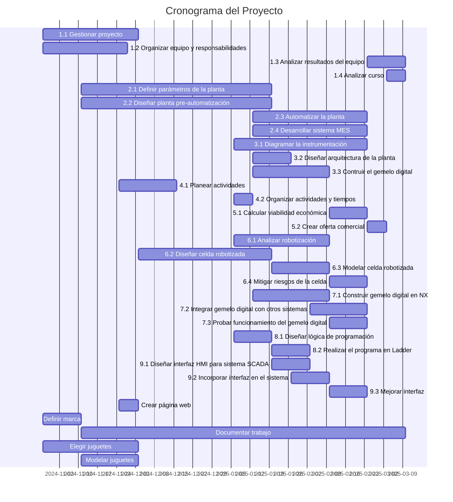
### Bitácoras

Para la supervisión del trabajo del equipo, se llevó a cabo un registro de bitácora donde cada uno agregaba horas de trabajo realizadass y en qué módulo del curso se enfocaron.

| Persona  | Horas  | Producción | Industria 4.0 | Planeación | Economía | Robótica | Gemelo Digital | PLC  | SCADA | Web o Github | Otro |
|----------|--------|------------|---------------|------------|----------|---------|---------------|------|-------|--------------|------|
| Sara     | 169.5  | 45         | 6             | 8          | 0        | 0       | 0             | 0    | 27.5  | 13           | 70   |
| Juan     | 198.5  | 49.5       | 16            | 6          | 3        | 0       | 32            | 0    | 0     | 21           | 71   |
| Manuel   | 164    | 6          | 3             | 8          | 6        | 53      | 4             | 0    | 0     | 18           | 66   |
| Felipe   | 168    | 8          | 22.5          | 7.5        | 11       | 0       | 0             | 20   | 0     | 32           | 67   |
| **Porcentaje tiempo** |        | **31.7**  | **13.9**  | **8.6**  | **5.8**  | **15.5** | **10.5** | **5.8**  | **8.0**  | **-**  | **-**  |
| **Porcentaje tiempo total** |        | **15.5**  | **6.8**  | **4.2**  | **2.9**  | **7.6**  | **5.1**  | **2.9**  | **3.9**  | **12.0**  | **39.1**  |

La fila de `Porcentaje tiempo` indica el porcentaje de tiempo dedicado a cada módulo sin tener en cuenta tareas que no forman parte de algún módulo como asistir a clase (capacitación equipo), realizar los videos, documentar el proyecto, etc.

La fila `Porcentaje tiempo total` incluye el porcentaje de tiempo total dedicado a cada parte del curso.

## Módulo 4: Evaluación Económica de Proyectos
El proyecto se propone para una duración de 5 años a partir de la fecha de iniciación.

Se estima un precio de venta para los juguetes de acuerdo a la siguiente tabla:
|Juguete|Precio de venta (COP)|
|-|-|
|Carro|$100.000|
|Avión|$75.000|
|Submarino|$85.000|

### Economía del Proyecto
El componente económico del proyecto consta de 3 items principales:
- Presupuesto para contratar el servicio del proyecto, las licencias asociadas a las tecnologías implementadas y compra de maquinaria nueva para la automatización.
- Costos mensuales asociados a la operación de la planta.
- Flujo de caja del proyecto que incluye los ingresos por producción y venta de juguetes, los gastos mensuales de operación y el valor de la inversión inicial para llevar a cabo el proyecto.
#### Presupuesto
Para llevar a cabo el proyecto se requiere de un presupuesto inicial representado en las siguientes tablas:

##### Honorarios + Licencias
| Concepto                  | Costo Unitario    | Concepto Cantidad     | Cantidad | Costo Total       |
|---------------------------|------------------|----------------------|----------|------------------|
| Salario Ingeniero 1       | $40.000          | Precio x hora        | 169,5    | $6.780.000       |
| Salario Ingeniero 2       | $40.000          | Precio x hora        | 198,5    | $7.940.000       |
| Salario Ingeniero 3       | $40.000          | Precio x hora        | 164      | $6.560.000       |
| Salario Ingeniero 4       | $55.000          | Precio x hora        | 168      | $9.240.000       |
| Licencia Ignition         | $33.200.000      | Licencia 1 año       | 1        | $33.200.000      |
| Licencia Siemens NX       | $62.250.000      | Licencia por siempre | 1        | $62.250.000      |
| Licencia Studio 5000      | $41.500.000      | Licencia 1 año       | 1        | $41.500.000      |
| Licencia Robot Studio     | $6.225.000       | Licencia 1 año       | 1        | $6.225.000       |

**TOTAL HONORARIOS:** $30.520.000

**TOTAL LICENCIAS:** $143.175.000 

##### Maquinaria + Puesta en marcha e imprevistos de montaje
| Concepto                         | Costo Unitario    | Concepto Cantidad                | Cantidad | Costo Total        |
|----------------------------------|------------------|--------------------------------|----------|------------------|
| Bandas transportadoras          | $95.706.940     | Cotización completa            | 1        | $95.706.940      |
| Bandas transportadoras celda    | $47.853.470     | Cotización completa            | 1        | $47.853.470      |
| Cilíndro neumático              | $2.000.000      | Por cilíndro                   | 3        | $6.000.000       |
| Compuerta neumática             | $1.600.000      | Por compuerta                   | 5        | $8.000.000       |
| Compresor                       | $3.000.000      | Por compresor                   | 1        | $3.000.000       |
| Sensores bandas y celda         | $887.348        | Por sensor                      | 14       | $12.422.872      |
| Tumbling machine                | $10.864.700     | Por máquina importada           | 1        | $10.864.700      |
| Celda robotizada                | $145.250.000    | Por celda                        | 1        | $145.250.000     |
| Cortinas láser                  | $3.195.500      | Por cortina                      | 6        | $19.173.000      |
| Barreras físicas                | $868.000        | Por metro de barrera            | 35       | $30.380.000      |
| Computadores                    | $5.000.000      | Promedio de computadores usados | 4        | $20.000.000      |
| Tableros de control             | $15.000.000     | Por tablero completo            | 3        | $45.000.000      |
| PLC CPU                         | $6.225.000      | Por PLC                          | 1        | $6.225.000       |
| PLC Módulos                     | $2.075.000      | Por Módulo                       | 8        | $16.600.000      |
| Puesta en marcha                | $139.942.795    | Porcentaje del total            | 1        | $139.942.795     |
| Imprevistos                     | $60.641.878     | Porcentaje del total            | 1        | $60.641.878      |

**TOTAL MAQUINARIA + PUESTA EN MARCHA:** $667.060.654

#### Costos
Para mantener el proyecto en funcionamiento se requiere de un gasto mensual estimado en lo definido en la siguiente tabla:

##### Gastos mensuales operativos
| Concepto                          | Costo Unitario    | Concepto Cantidad                     | Cantidad | Costo Total        |
|-----------------------------------|------------------|-------------------------------------|----------|------------------|
| Materia Prima Carro              | $25.000         | 1 juguete                          | 1        | $25.000         |
| Materia Prima Submarino          | $12.100         | 1 juguete                          | 1        | $12.100         |
| Materia Prima Avión              | $21.500         | 1 juguete                          | 1        | $21.500         |
| Cajas                             | $2.400          | 1 caja                             | 1        | $2.400          |
| Papel panal                       | $124.500        | 1 rollo (121 metros)               | 1        | $124.500        |
| Salario Operarios + Prestaciones  | $2.400.000      | Por operario                       | 26       | $62.400.000     |
| Energía                           | $1.026          | kW mes                             | 5670     | $5.817.420      |
| Arriendo espacio                  | $35.000.000     | Arriendo planta 2300 m² mes        | 1        | $35.000.000     |
| Mantenimiento                     | $7.774.600      | Repuestos y mantenimiento mensual  | 1        | $7.774.600      |
| Soporte Sistema                   | $1.000.000      | Valor por mes                      | 1        | $1.000.000      |
| Sistema AWS                       | $456.500        | Valor por uso al mes               | 1        | $456.500        |

#### Flujo de Caja
El flujo de caja consta de los ingresos y costos operativos (teniendo en cuenta las variaciones debido a la cantidad de juguetes producidos y vendidos mes a mes). Además, incluye una columna de inversión que corresponde con el valor de inversión dado en el presupuesto del proyecto (y los gastos anuales debido a las licencias). Se presenta la utilidad neta mes a mes durante los próximos 5 años, arrancando con un primer mes donde la planta se detiene para implementar los cambios y automatizarla. También, se coloca una columna de la ganancia total acumulada que permite visualizar cómo se recupera la inversión y en cuánto tiempo.
| Mes  | Ingresos       | Costo operativo | Inversión      | Utilidad Neta                                   | Ganancia Total                                 |
|------|---------------|----------------|---------------|-----------------------------------------------|----------------------------------------------|
| 1    | $0           | $110,992,020   | $840,755,654  | -$951,747,674 | -$951,747,674 |
| 2    | $222,248,000 | $169,909,331   | $0            | $52,338,669 | - $899,409,005 |
| 3    | $222,248,000 | $169,909,331   | $0            | $52,338,669 | - $847,070,336 |
| 4    | $201,099,000 | $164,441,960   | $0            | $36,657,040 | - $810,413,296 |
| 5    | $201,099,000 | $164,441,960   | $0            | $36,657,040 | - $773,756,257 |
| 6    | $137,574,500 | $148,016,683   | $0            | - $10,442,183 | - $784,198,440 |
| 7    | $137,574,500 | $148,016,683   | $0            | - $10,442,183 | - $794,640,623 |
| 8    | $222,248,000 | $169,909,331   | $0            | $52,338,669 | - $742,301,954 |
| 9    | $222,248,000 | $169,909,331   | $0            | $52,338,669 | - $689,963,285 |
| 10   | $793,699,000 | $317,655,485   | $0            | $476,043,515 | - $213,919,770 |
| 11   | $793,699,000 | $317,655,485   | $0            | $476,043,515 | $262,123,745 |
| 12   | $96,335,662  | $142,980,645   | $84,971,250   | - $131,616,232 | $130,507,513 |
| 13   | $96,335,662  | $142,980,645   | $0            | - $46,644,982 | $83,862,530 |
| 14   | $252,739,987 | $183,415,363   | $0            | $69,324,624 | $153,187,154 |
| 15   | $252,739,987 | $183,415,363   | $0            | $69,324,624 | $222,511,779 |
| 16   | $228,690,000 | $177,197,976   | $0            | $51,492,024 | $274,003,802 |
| 17   | $228,690,000 | $177,197,976   | $0            | $51,492,024 | $325,495,826 |
| 18   | $156,448,950 | $158,518,744   | $0            | - $2,069,794 | $323,426,031 |
| 19   | $156,448,950 | $158,518,744   | $0            | - $2,069,794 | $321,356,237 |
| 20   | $252,739,987 | $183,415,363   | $0            | $69,324,624 | $390,680,861 |
| 21   | $252,739,987 | $183,415,363   | $0            | $69,324,624 | $460,005,485 |
| 22   | $902,582,625 | $351,429,297   | $0            | $551,153,328 | $1,011,158,814 |
| 23   | $902,582,625 | $351,429,297   | $0            | $551,153,328 | $1,562,312,142 |
| 24   | $108,916,526 | $152,137,561   | $89,219,813   | - $132,440,847 | $1,429,871,295 |
| 25   | $108,916,526 | $152,137,561   | $0            | - $43,221,035 | $1,386,650,260 |
| 26   | $285,725,554 | $197,847,226   | $0            | $87,878,328 | $1,474,528,588 |
| 27   | $285,725,554 | $197,847,226   | $0            | $87,878,328 | $1,562,406,916 |
| 28   | $258,537,352 | $190,818,489   | $0            | $67,718,863 | $1,630,125,779 |
| 29   | $258,537,352 | $190,818,489   | $0            | $67,718,863 | $1,697,844,642 |
| 30   | $176,866,909 | $169,700,970   | $0            | $7,165,939  | $1,705,010,581 |
| 31   | $176,866,909 | $169,700,970   | $0            | $7,165,939  | $1,712,176,520 |
| 32   | $285,725,554 | $197,847,226   | $0            | $87,878,328 | $1,800,054,848 |
| 33   | $285,725,554 | $197,847,226   | $0            | $87,878,328 | $1,887,933,176 |
| 34   | $1,020,370,365 | $387,786,351   | $0            | $632,584,014 | $2,520,517,190 |
| 35   | $1,020,370,365 | $387,786,351   | $0            | $632,584,014 | $3,153,101,204 |
| 36   | $122,514,637 | $161,852,718   | $93,680,803   | - $133,018,883 | $3,020,082,321 |
| 37   | $122,514,637 | $161,852,718   | $0            | - $39,338,080 | $2,980,744,241 |
| 38   | $321,377,827 | $213,263,736   | $0            | $108,114,091 | $3,088,858,332 |
| 39   | $321,377,827 | $213,263,736   | $0            | $108,114,091 | $3,196,972,422 |
| 40   | $290,797,715 | $205,358,058   | $0            | $85,439,657  | $3,282,412,079 |
| 41   | $290,797,715 | $205,358,058   | $0            | $85,439,657  | $3,367,851,736 |
| 42   | $198,935,541 | $181,605,121   | $0            | $17,330,420  | $3,385,182,156 |
| 43   | $198,935,541 | $181,605,121   | $0            | $17,330,420  | $3,402,512,576 |
| 44   | $321,377,827 | $213,263,736   | $0            | $108,114,091 | $3,510,626,667 |
| 45   | $321,377,827 | $213,263,736   | $0            | $108,114,091 | $3,618,740,758 |
| 46   | $1,147,680,422 | $426,900,537   | $0            | $720,779,885 | $4,339,520,643 |
| 47   | $1,147,680,422 | $426,900,537   | $0            | $720,779,885 | $5,060,300,528 |
| 48   | $137,200,268 | $172,159,046   | $98,364,843   | - $133,323,621 | $4,926,976,907 |
| 49   | $137,200,268 | $172,159,046   | $0            | - $34,958,778  | $4,892,018,130 |
| 50   | $359,881,013 | $229,727,279   | $0            | $130,153,734 | $5,022,171,864 |
| 51   | $359,881,013 | $229,727,279   | $0            | $130,153,734 | $5,152,325,598 |
| 52   | $325,637,771 | $220,874,538   | $0            | $104,763,233 | $5,257,088,830 |
| 53   | $325,637,771 | $220,874,538   | $0            | $104,763,233 | $5,361,852,063 |
| 54   | $222,768,869 | $194,275,435   | $0            | $28,493,434  | $5,390,345,498 |
| 55   | $222,768,869 | $194,275,435   | $0            | $28,493,434  | $5,418,838,932 |
| 56   | $359,881,013 | $229,727,279   | $0            | $130,153,734 | $5,548,992,666 |
| 57   | $359,881,013 | $229,727,279   | $0            | $130,153,734 | $5,679,146,400 |
| 58   | $1,285,170,560 | $468,956,677   | $0            | $816,213,883 | $6,495,360,283 |
| 59   | $1,285,170,560 | $468,956,677   | $0            | $816,213,883 | $7,311,574,166 |

### Análisis de rentabilidad
Con base en el flujo de caja presentado, se realiza el análisis de rentabilidad del proyecto. Los siguientes indicadores son calculados:

#### Indicadores Financieros

Las fórmulas utilizadas para calcular cada uno de los indicadores financieros:

##### Tasa Interna de Retorno (TIR)
La TIR es la tasa de descuento que hace que el VPN sea cero:
$$
\sum_{t=0}^{n} \frac{FC_t}{(1 + TIR)^t} = 0
$$
Donde:
- $ FC_t $ es el flujo de caja en el periodo $ t $
- $ n $ es el número total de periodos

##### Valor Presente Neto (VPN)
El VPN se calcula como:
$$
VPN = \sum_{t=1}^{n} \frac{FC_t}{(1 + r)^t} - FC_0
$$
Donde:
- $ r $ es la tasa de descuento
- $ FC_0 $ es la inversión inicial
- $ FC_t $ son los flujos de caja en cada periodo $ t $

##### Payback (Tiempo de Recuperación)
El tiempo de recuperación ajustado es:
$$
Payback = A + \frac{|FC_0| - \sum_{t=1}^{A} FC_t}{FC_{A+1}}
$$
Donde:
- $ A $ es el último periodo con saldo negativo acumulado
- $ FC_{A+1} $ es el flujo de caja del siguiente periodo positivo

##### Retorno sobre la Inversión (ROI)
El ROI se define como:
$$
ROI = \frac{Utilidad\ Neta}{Inversión\ Inicial} \times 100\%
$$
o bien:
$$
ROI = \frac{FC_n - |FC_0|}{|FC_0|} \times 100\%
$$
Donde:
- $ FC_n $ es el flujo de caja acumulado al final del periodo

##### ROI Anualizado
Para calcular el ROI anualizado, se usa:
$$
ROI_{anual} = (1 + ROI)^{\frac{1}{n}} - 1
$$
Donde:
- $ n $ es el número de años del proyecto

##### Índice de Rentabilidad (IR)
El índice de rentabilidad se calcula como:
$$
IR = \frac{|FC_0| + VPN}{|FC_0|}
$$
Si $ IR > 1 $, el proyecto es rentable.

##### Margen de Utilidad
El margen de utilidad se calcula como:
$$
Margen = \frac{Utilidad\ Neta}{Ingresos\ Totales} \times 100\%
$$
o bien:
$$
Margen = \frac{\sum FC}{\sum Ingresos} \times 100\%
$$

**Notas:**
- $ FC_0 $ es la inversión inicial.
- $ FC_t $ son los flujos de caja en cada periodo.
- $ n $ es el número de periodos del proyecto.
- $ r $ es la tasa de descuento.
- $ A $ representa el último periodo con saldo acumulado negativo en Payback.

#### WACC
Para el cálculo del `VPN` se requiere una tasa de descuento. En proyectos empresariales es común utilizar el `WACC` (Weighted Average Cost of Capital) de la empresa.

$$
WACC = \left( \frac{E}{E + D} \times r_e \right) + \left( \frac{D}{E + D} \times r_d \times (1 - T) \right)
$$

Donde:
- $ E $ = Capital de la empresa
- $ D $ = Deuda
- $ r_e $ = Rentabilidad esperada del capital propio
- $ r_d $ = Tasa de interés de la deuda
- $ T $ = Tasa de impuestos

| **Concepto**              | **Valor**         |**Suposición**|
|---------------------------|-------------------|-|
| **Capital empresa (E)**   | $500.000.000      |La empresa ya cuenta con este valor ahorrado, disponible para invertir.
| **Deuda (D)**             | $451.747.674      |Lo faltante para conseguir el total de capital inicial para ejecutar el proyecto.
| **Rentabilidad esperada ($r_e$)** | 8,00%       |Valor de rentabilidad esperado por la empresa.
| **Tasa de interés deuda ($r_d$)** | 15,00%      |Tasa de interés del crédito bancario que podría conseguir la empresa.
| **Tasa de impuestos (T)** | 35,00%            |Tasa aproximada promedio para empresas en Colombia.
| **WACC**                  | 8,83%             |Valor calculado, utilizado como tasa de descuento para el cálculo de los indicadores

#### Valor de los indicadores

| Indicador         | Valor       | Detalle     |
|------------------|------------|------------|
| TIR             | 9,06%       | -          |
| VPN             | $31.279.676 | COP        |
| Payback         | 10,4493702  | meses      |
| ROI             | 668,23%     | -          |
| ROI anual       | 53,65%      | -          |
| IR              | 1,032865513 | Rentable   |
| Margen Utilidad | 34,18%      | -          |

Frente a lo esperado por la empresa, que es `8.83%`, se obtiene una `TIR` de `9.06%`, por lo cual es una buena inversión para la empresa. 

Se recupera la inversión en 10-11 meses, con beneficios estimados por al menos 5 años. 

Se obtiene un `ROI` bastante elevado, debido a que la inversión se recupera rápido (< 1 año) y genera ingresos cada vez mayores por al menos 4 años. Si bien `668%` es un porcentaje que parece ilógico, en realidad lo que nos dice es que por cada `1` peso invertido, se recuperan aproximadamente `7` pesos, ignorando la componente temporal de la inversión.

Se obtiene un `IR` mayor a `1`, por lo que la inversión es rentable.

Se obtiene un margen de utilidad de aproximadamente `34%`. Es decir, de cada `1` peso invertido, se obtiene una ganancia neta de `0.34` pesos.

### Oferta comercial

La oferta comercial detallada se encuentra en este [enlace](Files/Oferta_comercial.pdf).

## Módulo 5: Celda de Manufactura Robotizada
### Productos de entrada y salida de la celda

   

### Proceso de creación de la celda

 
La creación de la celda robotizada sigue una hoja de ruta estructurada que guía cada etapa del proceso, desde la orientación inicial hasta la validación final. Este diagrama de flujo detalla los pasos necesarios para analizar, diseñar, implementar y evaluar la celda, asegurando que cumpla con los objetivos del proyecto de manera eficiente y segura.

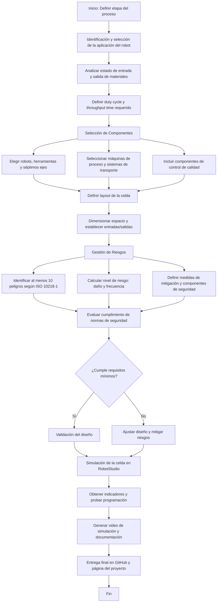

### Justificación y valor agregado

 La implementación de una celda robotizada para los procesos de empacado y paletizado se fundamenta en la necesidad de optimizar la eficiencia operativa, mejorar la calidad del producto final y garantizar la seguridad en las operaciones industriales. Este proyecto responde a diversos factores clave:

- **Incremento de la Productividad:** 

 La automatización de estos procesos permite aumentar significativamente la capacidad de producción al reducir los tiempos de ciclo, eliminar interrupciones innecesarias y minimizar el desperdicio de material. Las celdas robotizadas trabajan de manera continua, maximizando la utilización del tiempo y los recursos.

- **Mejora en la Precisión y Consistencia:** 

 Las tareas repetitivas como el empacado y el paletizado son propensas a errores cuando son realizadas manualmente. Con el uso de robots, se asegura una mayor precisión en la manipulación de productos y consistencia en la calidad del trabajo realizado.

- **Reducción de Costos Operativos:** 

 Aunque la inversión inicial para la adquisición y configuración de la celda robotizada puede ser significativa, se compensa a mediano y largo plazo mediante la reducción de costos asociados a errores humanos, horas extras y posibles mermas en el material.

- **Adaptabilidad y Flexibilidad:** 

 Las celdas robotizadas pueden ser programadas para manejar una amplia gama de productos y formatos, adaptándose a las necesidades cambiantes del mercado y permitiendo una rápida reconfiguración para nuevos procesos o productos.

- **Mejoras en la Seguridad Laboral:** 

 Al automatizar procesos que involucran levantamiento de cargas pesadas, movimientos repetitivos o condiciones potencialmente peligrosas, se reduce significativamente el riesgo de accidentes laborales y se mejora el bienestar de los empleados. Además, se evitan problemas de salud derivados de tareas repetitivas, como lesiones musculoesqueléticas, garantizando una mejor calidad de vida para los trabajadores.

- **Competitividad en el Mercado:** 

 La implementación de tecnologías avanzadas como la robótica industrial permite a la empresa mantenerse competitiva, respondiendo rápidamente a las demandas del mercado y cumpliendo con los estándares internacionales de calidad y eficiencia.

- **Sostenibilidad y Reducción del Impacto Ambiental:** 

 La automatización contribuye a una gestión más eficiente de los recursos, disminuyendo el desperdicio de materiales y optimizando el consumo energético, lo que se traduce en una menor huella ambiental.

### Diseño
#### Relación con el proceso de manufactura
#### Funcionalidad del robot

**Criterios de selección de los robots**
Los criterios utilizados se basaron en las necesidades específicas del proceso productivo, considerando el peso promedio de los juguetes y las dimensiones de los pallets.

***Capacidad de carga (Pay Load):***
- **Peso promedio del juguete:** 1,2 kg.
- Se seleccionaron robots con capacidad suficiente para manejar las cargas sin comprometer la velocidad ni precisión.

***Área de trabajo:***
- **Tamaño de los pallets:** 0,8 m x 1,2 m.
- Se seleccionaron robots con áreas de alcance adecuadas para cubrir el movimiento requerido en el proceso.

***Aplicación específica:***
- **Empaque:** Requiere alta velocidad y precisión para manejar objetos ligeros, ideal para el IRB 360.
- **Paletizado:** Requiere fuerza y un alcance mayor para manejar cajas y pallets completos, ideal para el IRB 1520.

**Características técnicas de los robots seleccionados**

***IRB 360 (Robot Delta):***

- **Carga útil máxima (Payload):** Hasta 3 kg.
- **Área de trabajo (Radio):** Hasta 1,6 m.
- **Repetibilidad:** ±0,1 mm.
- **Velocidad máxima:** Alta velocidad para aplicaciones de empaquetado rápido.
- **Aplicaciones:** Ideal para empaquetado, pick and place, y tareas de alta precisión.

***IRB 1520 (Robot Antropomorfico):***

- **Carga útil máxima (Payload):** Hasta 4 kg.
- **Área de trabajo (Alcance):** Hasta 1,8 m.
- **Repetibilidad:** ±0,1 mm.
- **Velocidad:** Optimizado para paletizado con ciclos rápidos y eficientes.
- **Aplicaciones:** Perfecto para manejar cajas y pallets en tareas de paletizado industrial.

***IRB 360 (Empacado):***
 - **Función principal:** Realiza tareas de empaquetado de juguetes en las líneas de producción, manipulando objetos individuales con alta velocidad y precisión.
 - **Justificación:** Diseñado para manejar cargas ligeras, como juguetes de 1,2 kg, con precisión y alta velocidad, ideal para procesos de empaque rápido.

  
  

***IRB 1520 (Paletizado):***
- **Función principal:** Encargado de paletizar cajas o productos terminados (juguetes ya empaquetados) en pallets de tamaño estándar de 0,8 m x 1,2 m.
- **Justificación:** Su capacidad de carga y área de trabajo lo convierten en la elección ideal para manipular pallets y organizar grandes volúmenes de productos.

  
   

#### Interacción con operarios

 La celda robotizada ha sido diseñada para trabajar de manera conjunta con el personal humano, maximizando la eficiencia del proceso y aprovechando las fortalezas tanto de la automatización como de las capacidades humanas. La interacción entre los robots y los operarios se desarrolla en las siguientes etapas:

**Preparación de Materiales**
- 
 Los operarios se encargan de cortar el plástico burbuja al tamaño adecuado, asegurando que cada juguete cuente con la protección necesaria antes de ser empacado.
- 
 Preparan y ensamblan las cajas, colocándolas listas para su llenado en la banda transportadora.

**Colocación y Disposición**
- 
 El personal dispone las cajas y el plástico burbuja sobre las bandas transportadoras para que los robots IRB 360 puedan proceder con la tarea de empacado.

**Supervisión de Operaciones**
- 
 Los operarios supervisan el funcionamiento de los robots, garantizando que las operaciones de empacado y paletizado se desarrollen sin interrupciones.
- 
 Pueden intervenir en caso de que surjan problemas, como obstrucciones en las bandas o fallos menores en el sistema.

**Sellado de Cajas**
- 
 Una vez que los robots han completado el empacado, el personal humano sella las cajas, asegurando que estén listas para su transporte y distribución.

**Soporte y Mantenimiento**
- 
 Los operarios están capacitados para realizar tareas básicas de mantenimiento preventivo en la celda, como limpieza, ajustes simples y monitoreo de los indicadores de desempeño de los robots.

**Colaboración en Seguridad**
- 
 El personal trabaja en conjunto con el sistema de seguridad de la celda, cumpliendo con los protocolos establecidos y verificando el correcto funcionamiento de las barreras de seguridad y sensores.

#### Análisis y gestión de riesgos

 En el desarrollo de la celda robotizada, es fundamental identificar y gestionar los posibles riesgos asociados a cada etapa del proceso. La siguiente tabla detalla las tareas principales, sub-tareas y los riesgos potenciales relacionados con el funcionamiento, mantenimiento y manejo de productos en la celda. Este análisis permite implementar medidas preventivas y protocolos de seguridad que garanticen un entorno de trabajo seguro y eficiente tanto para los operarios como para los equipos involucrados.

| **Tarea**                   | **Subtarea**                  | **Riesgo**                                                                                     | **ID** |
|-----------------------------|-------------------------------|------------------------------------------------------------------------------------------------|--------|
| **Funcionamiento**          | NA                            | Ingreso de personal en el área de los Robots.                                                     | R1     |
|                             | NA                            | Operarios interrumpiendo el camino de los Robots.                                                  | R2     |
|                             | NA                            | Los juguetes pueden caer por sujeción incorrecta del Robot.                                                | R3     |
|                             | Supervisión del proceso       | Fatiga visual o distracción del personal encargado de la monitorización de los procesos.                              | R4     |
|                             | Reabastecimiento de materiales | Contacto con partes móviles, riesgo de atrapamiento.                                           | R5    |
| **Mantenimiento**           | Ajuste o cambio del gripper   | Caída de objetos, puntos de atrapamiento, resbalones/tropiezos, superficies filosas.           | R6     |
|                             | Ajuste de rutina de robot     | Entrada a espacio confinado: equipo en movimiento, golpe por objetos, atrapamiento, aplastamiento. | R7     |
|                             | Cambio de batería de robot    | Contacto con electricidad, puntos de atrapamiento, superficies filosas.                       | R8     |
|                             | Limpieza de celda             | Puntos de atrapamiento, resbalones/tropiezos, superficies filosas, exposición a productos químicos. | R9     |
|                             | Verificación de sensores      | Contacto con partes móviles, riesgo de atrapamiento.                                          | R10    |
|                             | Inspección de piezas críticas | Lesiones por herramientas mal usadas o deterioradas, exposición a piezas filosas o cortantes. | R11    |
| **Entrada y salida del producto** | NA                     | Operarios interrumpiendo el espacio de trabajo de los Robots.                                                 | R12     |
|                             | Revisión de entrada/salida    | Desalineación de cajas o juguetes, riesgo de golpes o tropiezos.                              | R13    |
|                             | Manipulación manual           | Levantamiento inadecuado de cargas, riesgo de lesiones musculoesqueléticas.                   | R14    |
|                             | Control de flujo              | Atascos en bandas transportadoras, atrapamiento por correas.                                   | R15    |

 Como parte del diseño de la celda robotizada, se elaboró una matriz de riesgos siguiendo los lineamientos establecidos en la norma <strong>IEC 62061</strong>, que proporciona un marco para evaluar y gestionar los riesgos en sistemas de control eléctricos relacionados con la seguridad. Este análisis permitió comparar los niveles de riesgo antes y después de implementar medidas de mitigación.

 La matriz de riesgos se construyó identificando peligros potenciales, evaluando su probabilidad de ocurrencia y las posibles consecuencias, tanto en el estado inicial como tras aplicar las medidas de seguridad. Este enfoque sistemático asegura una reducción efectiva de los riesgos, priorizando la seguridad de los operarios y la funcionalidad confiable del sistema.

| **ID** | **Severidad (S)** | **Frecuencia (F)** | **Probabilidad (W)** | **Probabilidad de evitar o limitar daño (P)** | **Clase (K)** | **Clasificación de riesgo** |
|--------|--------------------|---------------------|-----------------------|-----------------------------------------------|---------------|-----------------------------|
| R1     | 4                  | 4                   | 4                     | 5                                             | 13            | SIL 3                       |
| R2     | 3                  | 5                   | 3                     | 5                                             | 13            | SIL 2                       |
| R3     | 4                  | 2                   | 3                     | 5                                             | 10            | SIL 2                       |
| R4     | 2                  | 2                   | 4                     | 4                                             | 10            | SIL 1                       |
| R5     | 4                  | 2                   | 3                     | 5                                             | 9             | SIL 1                       |
| R6     | 3                  | 1                   | 3                     | 5                                             | 9             | SIL 1                       |
| R7     | 4                  | 3                   | 3                     | 5                                             | 11            | SIL 3                       |
| R8     | 3                  | 5                   | 3                     | 5                                             | 13            | SIL 2                       |
| R9     | 4                  | 2                   | 3                     | 5                                             | 10            | SIL 2                       |
| R10    | 4                  | 3                   | 3                     | 5                                             | 11            | SIL 3                       |
| R11    | 4                  | 2                   | 3                     | 5                                             | 10            | SIL 2                       |
| R12    | 3                  | 5                   | 3                     | 5                                             | 13            | SIL 2                       |
| R13    | 3                  | 2                   | 3                     | 4                                             | 9             | SIL 1                       |
| R14    | 3                  | 2                   | 3                     | 4                                             | 9             | SIL 1                       |
| R15    | 4                  | 3                   | 3                     | 5                                             | 11            | SIL 3                       |

#### Seguridad

 Con el objetivo de garantizar un entorno de trabajo seguro y eficiente en la operación de la celda robotizada, se han diseñado e implementado una serie de acciones específicas para mitigar los riesgos identificados. Estas medidas no solo buscan prevenir incidentes, sino también promover la continuidad operativa, proteger a los operarios y optimizar el desempeño de los equipos. Las acciones planificadas incluyen:

| **ID** | **Actividades de mitigación**                                                                                                                                                  |
|--------|--------------------------------------------------------------------------------------------------------------------------------------------------------------------------------|
| R1     | Instalación de cortinas láser, instalación de mallas de celda, programación de la celda con interrupciones en las rutinas, botones de parada de emergencia, uso de EPP.        |
| R2     | Señalización del espacio de trabajo de cada uno de los robots, uso de EPP.                                                             |
| R3     | Uso de EPP, verificación continua de las condiciones del gripper.                                                                                                             |
| R4     | Creación de protocolos de seguridad para cambios de gripper, apagar todas las fuentes de energía de la celda durante el procedimiento, uso de EPP.                            |
| R5     | Verificación de las rutinas en simulación, no permitir el ingreso al área de trabajo durante la prueba de las rutinas, uso del teach pendant con dead man switch, uso de EPP. |
| R6     | Apagar todas las fuentes de energía del robot, uso de protecciones dieléctricas, uso de EPP.                                                                                  |
| R7     | Creación de protocolos de seguridad para limpieza de la celda, apagar todas las fuentes de energía de la celda durante el procedimiento, uso de EPP.                          |
| R8     | eñalización del espacio de trabajo de cada uno de los robots, uso de EPP.                                                             |
| R9     | Identificar y señalizar los puntos de atrapamiento, uso de guantes resistentes a químicos, protocolos para limpieza y manejo de productos químicos.                            |
| R10    | Apagar equipos antes de la verificación de sensores, uso de sistemas de bloqueo y etiquetado (LOTO), uso de EPP.                                                              |
| R11    | Inspección regular de herramientas, protocolos para el manejo seguro de piezas filosas, uso de guantes de protección.                                                         |
| R12    | Delimitar áreas de trabajo de robots, sistemas de monitoreo para detectar presencia humana, señalización adecuada, uso de EPP.                                                |
| R13    | Asegurar alineación de cajas o juguetes en bandas, protocolos para evitar tropiezos, mantenimiento preventivo de equipos.                                                     |
| R14    | Capacitación en levantamiento de cargas, uso de herramientas de asistencia ergonómica, pausas activas para evitar lesiones musculoesqueléticas.                                |
| R15    | Mantenimiento preventivo para evitar atascos, instalación de sistemas de parada automática en bandas transportadoras, señalización de zonas de riesgo.                        |

 Después de implementar las medidas de mitigación correspondientes, se elaboró una nueva matriz de riesgos actualizada. Esta matriz refleja la reducción en la probabilidad y/o severidad de los riesgos previamente identificados, demostrando la efectividad de las acciones correctivas aplicadas.

| **ID** | **Severidad (S)** | **Frecuencia (F)** | **Probabilidad (W)** | **Probabilidad evitar o limitar daño (P)** | **Clase (K)** | **Clasificación de riesgo** |
|--------|--------------------|---------------------|-----------------------|-------------------------------------------|---------------|-----------------------------|
| R1     | 4                  | 3                   | 2                     | 2                                         | 7             | SIL2                       |
| R2     | 3                  | 2                   | 2                     | 1                                         | 5             | OM                         |
| R3     | 4                  | 2                   | 3                     | 1                                         | 6             | SIL1                       |
| R4     | 2                  | 2                   | 3                     | 3                                         | 7             | N/A                        |
| R5     | 4                  | 2                   | 2                     | 2                                         | 7             | SIL1                       |
| R6     | 3                  | 1                   | 2                     | 2                                         | 5             | OM                         |
| R7     | 4                  | 3                   | 2                     | 2                                         | 7             | SIL2                       |
| R8     | 3                  | 2                   | 2                     | 1                                         | 5             | OM                         |
| R9     | 4                  | 2                   | 3                     | 2                                         | 7             | SIL2                       |
| R10    | 4                  | 3                   | 2                     | 2                                         | 7             | SIL2                       |
| R11    | 3                  | 2                   | 3                     | 1                                         | 6             | SIL2                       |
| R12    | 3                  | 2                   | 2                     | 1                                         | 5             | OM                         |
| R13    | 3                  | 2                   | 2                     | 1                                         | 5             | OM                         |
| R14    | 3                  | 2                   | 2                     | 1                                         | 5             | OM                         |
| R15    | 4                  | 3                   | 2                     | 2                                         | 7             | SIL2                       |

 Por último, se lleva a cabo una comparación detallada de las clasificaciones de riesgo antes y después de implementar las medidas de mitigación. Los resultados evidencian una disminución significativa en los niveles de riesgo identificados, lo que refleja la efectividad de las acciones correctivas y preventivas adoptadas. Este análisis no solo demuestra la mejora en la seguridad operativa, sino que también valida el enfoque estratégico utilizado para minimizar peligros, garantizando un entorno más seguro y eficiente para los operarios y el equipo.

| **ID** | **Clasificación de riesgo antes** | **Clasificación de riesgo después** |
|--------|-----------------------------------|-------------------------------------|
| R1     | SIL 3                             | SIL 2                               |
| R2     | SIL 2                             | OM                                  |
| R3     | SIL 2                             | SIL 1                               |
| R4     | SIL 1                             | N/A                                 |
| R5     | SIL 2                             | SIL 1                               |
| R6     | SIL 1                             | OM                                  |
| R7     | SIL 3                             | SIL 2                               |
| R8     | SIL 2                             | OM                                  |
| R9     | SIL 3                             | SIL 2                               |
| R10    | SIL 3                             | SIL 2                               |
| R11    | SIL 2                             | SIL 1                               |
| R12    | SIL 2                             | OM                                  |
| R13    | SIL 1                             | OM                                  |
| R14    | SIL 1                             | OM                                  |
| R15    | SIL 3                             | SIL 2                               |

#### Elementos de Seguridad

**Matriz de Riesgos (Basada en GUIDELINE for Safeguarding Machinery and Equipment)**

| **Tarea**  | **Riesgo** | **Estimación del riesgo** | **Nivel** | **Método de reducción de riesgo** | **Equipo necesario** | **Imágen** | **Mitigación con Manuales, Entrenamiento y EPP** |
|------------|-----------|---------------------------|-----------|------------------------------------|----------------------|-----------|-----------------------------------------------|
| **Funcionamiento del robot (Pick and Place y Paletizado)** | El robot podría moverse de manera inesperada y golpear a un operario. | - Seriedad: alta    - Frecuencia: media   - Difícil de evitar | D | Instalación de **barreras láser** que detengan el robot al detectar presencia en la zona de trabajo. | **Barreras láser de seguridad** |  | Capacitación en operación segura del robot y protocolos de seguridad. |
| **Movimiento de objetos en el transportador** | Posible caída de productos por un mal posicionamiento del robot en Pick and Place. | - Seriedad: media    - Frecuencia: alta   - Fácil de evitar | C | Revisión continua del sistema de sujeción del robot y ajuste periódico de la presión del gripper. | **Sensores de presión en el gripper.** |  | Manual de calibración y ajuste del gripper, entrenamiento en mantenimiento preventivo. |
| **Señalización de estado de la celda** | Falta de advertencias visuales sobre el estado del proceso puede provocar accidentes. | - Seriedad: media    - Frecuencia: alta   - Difícil de evitar | C | Uso de **Industrial Tower Light** para indicar estados de peligro, alerta y operación normal. | **Industrial Tower Light.** |  | Manual de interpretación de señales luminosas y capacitación en protocolos de emergencia. |
| **Interacción con operarios en la estación manual de sellado** | Un operario podría ingresar accidentalmente al área de trabajo del robot. | - Seriedad: alta    - Frecuencia: baja   - Difícil de evitar | D | Instalación de **barreras físicas** y delimitación del área de trabajo del robot. | **Barreras físicas de protección.** |  | Entrenamiento en procedimientos de acceso restringido y uso de señalización de seguridad. |
| **Emergencias en la celda** | En caso de fallo del sistema, el operario podría no tener una forma rápida de detener el proceso. | - Seriedad: alta    - Frecuencia: baja   - Fácil de evitar | C | Implementación de **botones de parada de emergencia** en puntos estratégicos. | **Botón de parada de emergencia.** |  | Capacitación en protocolos de emergencia y simulacros periódicos. |
| **Zona de trabajo del operario** | Riesgo de tropiezos o resbalones en áreas críticas. | - Seriedad: media    - Frecuencia: media   - Fácil de evitar | C | Instalación de **Safety Mats** que detengan el robot si alguien pisa la zona de riesgo. | **Safety Mats (alfombras de seguridad).** |  | Uso obligatorio de calzado antideslizante y protocolos de orden y limpieza en la zona de trabajo. |

**Explicación de la Matriz de Riesgos**
**Barreras láser:** Previenen el acceso no autorizado a la zona del robot.  
**Sensores en el gripper:** Aseguran una correcta sujeción de los productos en el Pick and Place.  
**Industrial Tower Light:** Proporciona alertas visuales sobre el estado del sistema.  
**Barreras físicas:** Evitan el ingreso involuntario a zonas de riesgo.  
**Botones de parada de emergencia:** Permiten detener la celda rápidamente en caso de problemas.  
**Safety Mats:** Detectan la presencia de un operario en zonas peligrosas y detienen el robot automáticamente.  

Este análisis garantiza un entorno de trabajo **seguro y eficiente**, protegiendo a los operarios mientras se mantiene un flujo óptimo en la celda robotizada.

### RobotStudio
#### Descripción del Layout

**1. Entrada de Cajas**
- Las cajas ingresan a la línea de producción a través de una banda transportadora.
- El flujo está marcado con flechas rojas indicando la dirección del movimiento.

**2. Entrada de Juguetes y Papel Panal**
- Los juguetes y el papel panal llegan desde líneas verticales a puntos de intersección con la banda principal.
- Estos materiales son manipulados por robots en los puntos señalados con líneas azules diagonales.

**3. Proceso de Empacado**
- Se observa la interacción de robots en la integración de juguetes y papel panal dentro de las cajas.
- La presencia de estos robots mejora la precisión y la velocidad del empacado.

**4. Estación Manual de Sellado**
- Después del empacado, las cajas se dirigen a una estación de sellado manual, identificada con color rosa.
- Aquí, los operarios sellan las cajas antes de continuar al proceso de almacenamiento y paletizado.

**5. Almacén de Producto en Proceso**
- Se encuentra identificado en color verde.
- Sirve como un área temporal antes de la siguiente fase del proceso.

**6. Proceso de Paletizado**
- Un robot, representado nuevamente con líneas diagonales azules, se encarga de organizar las cajas en pallets.
- La salida de los pallets está claramente definida con una flecha roja descendente.

**Características y Ventajas del Diseño**
**Flujo optimizado:** El diseño minimiza desplazamientos innecesarios y permite una transición eficiente entre las etapas.  
**Automatización con robots:** La manipulación de juguetes y papel panal por robots reduce errores y mejora la velocidad de empacado.  
**Interacción humana y robótica:** Se mantiene un equilibrio entre estaciones automatizadas y tareas manuales, como el sellado.  
**Claridad en las zonas de trabajo:** Las diferentes secciones están bien identificadas, lo que facilita la supervisión y el mantenimiento.  

Este diseño contribuye a la eficiencia de la celda de manufactura, asegurando un flujo de producción fluido desde la llegada de materiales hasta la salida de pallets listos para distribución.

**Diagrama de Flujo**
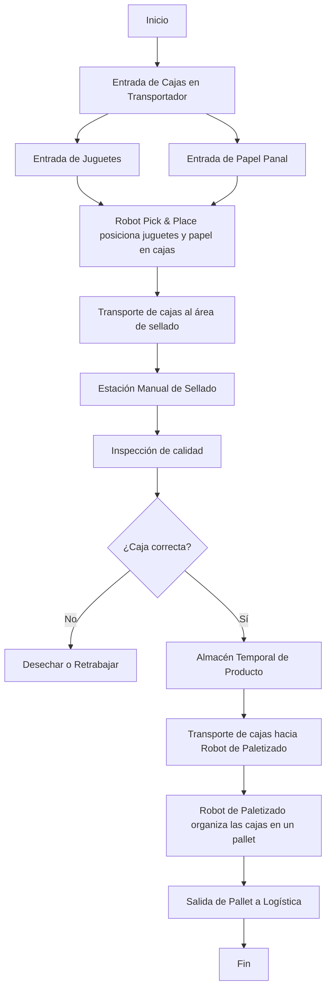

**1. Inicio del Proceso**
- Se introducen **cajas, juguetes y papel panal** en la celda a través de transportadores.

**2. Proceso de Empacado**
- Un **robot Pick & Place** posiciona juguetes y papel panal dentro de cada caja.
- Las cajas son transportadas automáticamente hacia la **estación de sellado**.

**3. Estación de Sellado e Inspección de Calidad**
- **Los operarios sellan las cajas manualmente**.
- Se realiza una **inspección de calidad** para verificar que el producto esté correctamente empaquetado.

**4. Rama de Decisión: ¿Caja correcta?**
- **Si la caja no cumple los estándares**, se **rechaza o se retrabaja** antes de continuar.
- **Si la caja está en buenas condiciones**, se **almacena temporalmente** antes del paletizado.

**5. Proceso de Paletizado**
- **El transportador lleva las cajas al robot de paletizado**.
- **El robot organiza las cajas en pallets** para su almacenamiento y distribución.

**6. Salida del Pallet a Logística**
- **El pallet es transportado fuera de la celda robotizada**, concluyendo el proceso.

**7. Fin del Proceso**
- **El ciclo finaliza cuando las cajas ya están listas para su distribución**.

#### Modelado

**Partes de la Celda Robotizada**

**1. Sección de Empacado**
- **Robot IRB 360 (Empacado):** Realiza Pick & Place de juguetes y papel panal en las cajas.
- **Banda de Alimentación de Cajas:** Transporta cajas vacías hacia la zona de empaquetado.
- **Banda de Alimentación de Juguetes:** Suministra los juguetes a los robots IRB 360.
- **Banda de Alimentación de Papel Panal:** Proporciona material de protección para el empaquetado.

**2. Estación Manual**
- **Estación de Sellado Manual:** Los operarios sellan las cajas antes del paletizado.
- **Almacén de Producto en Proceso:** Área de almacenamiento temporal antes del paletizado.

**3. Sección de Paletizado**
- **Robot IRB 1520 (Paletizado):** Organiza las cajas en los pallets.
- **Pallet:** Base de almacenamiento antes del transporte fuera de la celda.

**4. Seguridad y Control**
- **Barreras Físicas:** Delimitan el área de los robots para evitar acceso no autorizado.
- **Cortina Láser de Seguridad:** Detecta presencia y detiene el sistema si es necesario.
- **Parada de Emergencia:** Botón para detener el sistema en caso de fallos.
- **Alfombra de Seguridad:** Detiene el sistema si alguien pisa la zona de peligro.
- **Torre de Iluminación de Proceso:** Indica el estado operativo de la celda.
- **Panel de Control Eléctrico:** Gestiona los robots y transportadores.
- **Controlador del Robot y Teach Pendant:** Permite programar y ajustar los robots.

#### Rutinas de Movimiento de los Robots

**Robot 1: Pick & Place de Juguetes**
Este robot toma el juguete desde la **banda de alimentación de juguetes** y lo coloca dentro de la **caja de cartón** proveniente de la **banda de alimentación de cajas**.  

Su movimiento es **cíclico** y sigue una trayectoria predefinida para garantizar precisión y velocidad en el proceso.

- [Rutina del IRB 360 (Pick & Place de Juguetes)](RobotStudio/Module1_IRB360_1.mod)

**Robot 2: Posicionamiento de Papel Panal**
Encargado de tomar el **papel panal** y colocarlo sobre el juguete ya alojado en la caja.  
Este paso es esencial para **proteger el producto** durante su distribución.  

Su rutina de movimiento también es **cíclica**, asegurando una colocación uniforme del material de protección.

- [Rutina del IRB 360 (Colocación de Papel Panal)](RobotStudio/Module1_IRB360_2.mod)

**Robot 3: Paletizado de Cajas**
Este robot organiza las cajas provenientes de la **estación de sellado manual** sobre un **pallet de madera**.  

La **banda de alimentación de cajas selladas** las posiciona con precisión antes de la manipulación.  
El proceso permite que un **montacargas** retire el pallet listo para su distribución.  
Su rutina de movimiento es **cíclica** y optimizada para maximizar la eficiencia del almacenamiento.

- [Rutina del IRB 1520 (Paletizado)](RobotStudio/Module1_IRB1520.mod)

#### Simulación

**Simulación etapa de Empacado - Parte 1**

**Simulación etapa de Empacado - Parte 2**

**Simulación etapa de Paletizado**

**Simulación Celda Robotizada**

**Simulación Celda Robotizada - Realidad Aumentada**

**Incursión en la Industria 5.0 - Análisis del Módulo de Detección de Fatiga**

El módulo desarrollado y presentado en el video es un ejemplo de **Industria 5.0**, ya que incorpora tecnología para evaluar el nivel de fatiga de un operario. Cuando este supera el 60%, el sistema apaga la celda robotizada para garantizar su seguridad.  

**¿Por qué es Industria 5.0?**

A diferencia de la **Industria 4.0**, que se enfoca en la automatización y optimización, la **Industria 5.0** busca integrar la tecnología con el trabajo humano para mejorar las condiciones laborales. Este módulo cumple con varios principios de este enfoque:

**1. Interacción entre humanos y robots**

- El robot no solo ejecuta tareas, sino que responde al estado del operario.  

**2. Seguridad y bienestar del operario**  

- Si la fatiga supera el 60%, la celda se detiene para evitar riesgos.  

**3. Uso de sensores e inteligencia artificial**  

- El sistema puede incluir sensores de visión o análisis de gestos para evaluar el nivel de fatiga.  

**4. Equilibrio entre eficiencia y seguridad**  

- En lugar de priorizar solo la producción, también se considera la condición del operario.  

**Aplicaciones y futuro**

Este tipo de sistemas puede ayudar a reducir la fatiga laboral y mejorar la seguridad en entornos industriales. En el futuro, podrían incluir funciones más avanzadas como pausas personalizadas o ajustes en la carga de trabajo según el estado del operario.  

**Conclusión**

El módulo de detección de fatiga se alinea con la **Industria 5.0**, ya que permite que el robot adapte su funcionamiento según el estado del operario. Este tipo de soluciones pueden mejorar la seguridad en la industria sin comprometer la productividad.  

## Módulo 6: Digital Factory
La implementación de una fábrica digital mediante el software NX de Siemens ha permitido modelar y simular procesos clave en la automatización de la planta de fabricación de juguetes de plástico. A través de esta herramienta, se han representado virtualmente los sistemas de producción, lo que permite analizar el desempeño de distintos componentes automatizados.
Dado los cambios sugeridos en la propuesta de automatización (compra de una máquina de pulido por vibración, instalación de una celda robotizada e instalación de un sistema de bandas transportadoras completamente automatizado), la fábrica digital desarrollada en Siemens NX incluye todas las etapas previas al inicio de la celda robotizada, ya que este proceso será simulado en RobotStudio. Para lograr una integración eficiente entre ambos softwares, se implementa la comunicación mediante un servidor OPC UA.
### Siemens NX
#### Entorno y modelamiento
Siguiendo el layout propuesto anteriormente en el software Tecnomatix, se implementaron las distintas estaciones que conforman el proceso de manufactura. Finalmente, la fábrica digital cuenta con las siguientes etapas y estaciones de producción:
- **Mezcla de plástico**  
- **Dosificación**  
- **Inyección**  
- **Desbarbado**  
- **Ensamble parcial**  
- **Ensamble final**  
- **Etapa de salida hacia la celda robótica**  

Además, se incluyen bandas transportadoras que funcionan como medio de transporte entre las distintas etapas.
#### Actuadores virtuales

* **Banda transportadora principal**  
  Se trata de una banda transportadora de 26 m de longitud y 0.6 m de ancho, encargada de conectar las bandas secundarias provenientes de cada una de las inyectoras y llevar las piezas hacia las estaciones de desbarbado. Se desplaza a una velocidad constante de 2 m/s y recibe una señal desde el PLC que permite encenderla o apagarla.
  

* **Bandas transportadoras secundarias**  
  Se implementaron un total de seis bandas transportadoras, divididas en dos grupos de tres. Cada una tiene dimensiones de 4.5 m de largo por 0.6 m de ancho. El primer grupo transporta las piezas desde las inyectoras hasta la banda principal, mientras que el segundo las traslada desde la banda principal hasta sus respectivas estaciones de desbarbado. Todas las bandas operan de manera continua a una velocidad de 2 m/s y reciben una señal del PLC que permite encenderlas o apagarlas.  

* **Cilindros neumáticos**  
  Su función es empujar las piezas transportadas por la banda principal hacia las distintas bandas secundarias, que luego las conducen a sus respectivas estaciones de desbarbado. En la simulación, estos cilindros se representan como una articulación prismática que recibe un número entero desde el PLC. Este número corresponde a la posición (expresada en milímetros) a la que debe desplazarse el cilindro. Una vez que las piezas han sido redirigidas a sus respectivas bandas secundarias, el cilindro regresa a su posición de origen para permitir el paso de las demás piezas que se desplazan a lo largo de la banda transportadora principal.
  

* **Actuadores angulares**  
  Estos actuadores bloquean el paso hacia la banda principal cuando se detectan piezas de un tipo diferente, evitando que sean enviadas a una estación de desbarbado incorrecta. En la simulación, su funcionamiento se representa mediante un número entero enviado desde el PLC, el cual indica la posición (expresada en grados) a la que debe desplazarse el actuador.
  

#### Sensores virtuales
* **Sensores infrarrojos**

   En simulación, se utilizan como sensores de colisión, permitiendo detectar si una pieza ha llegado a una posición determinada y, con base en ello, tomar una acción. En la fábrica digital, estos sensores permiten identificar si las piezas están próximas a ingresar a la banda principal o si se acercan a la banda secundaria, que las conducirá hacia la estación de desbarbado.
  

#### Simulación
Para la simulación en la fábrica digital de Siemens NX, se implementa la rutina utilizada en el arreglo de bandas automatizadas. De esta manera, es posible validar que los sensores, actuadores y la lógica de programación se integren correctamente, permitiendo que las piezas provenientes de las inyectoras lleguen a sus respectivas estaciones de desbarbado. Una vez en este punto, se simula el paso de las piezas por las distintas estaciones de ensamble hasta obtener un juguete completo, el cual continúa su recorrido por una banda transportadora que lo dirige hacia la celda robotizada, cuya simulación se realizará en RobotStudio.
## Módulo 7: Controladores industriales (PLC)
El controlador PLC se encargará de gestionar los siguientes procesos dentro de la planta:
- Proceso de inyección para cada una de las 3 inyectoras
- Movilización de los elementos inyectados hacia la banda principal
- Movilización de los elementos inyectados hacia su respectiva estación de almacenaje para posterior procesamiento manual por parte de los operarios.
- Movilizar los juguetes terminados hacia la celda robotizada.

### Elementos a controlar
Se clasificaron las secciones de la planta de las cuales se encarga el controlador de la siguiente manera:
- Inyectora A
- Inyectora B
- Inyectora C
- Banda Principal
- Estación A
- Estación B
- Estación C
- Celda

Cada `inyectora` cuenta con una banda transportadora, una compuerta y 2 sensores.

La `banda principal` es una única banda transportadora (actuador) por la que pasan todas las piezas inyectadas de manera controlada.

Cada `estación` cuenta con una compuerta (sobre la banda principal), con un cilindro neumático (localizado sobre la banda principal), con un sensor (localizado sobre la banda principal) y con una banda transportadora que moviliza las piezas hacia zonas de almacenaje para posterior intervención manual.

La `celda` robotizada cuenta con varios sensores, actuadores y controladores mencionados su respectiva sección. Desde el punto de vista del controlador PLC de la planta, solo se cuenta con 2 sensores y una banda transportadora que se conecta con la celda.

### Definición de las tags
Las *tags* son aquellas variables del controlador que se asocian al proceso, como lo son una medida de un sensor, una señal de control para un actuador, un valor de conteo de producción, etc.

Para cada uno de los elementos a controlar `X`, se definieron los siguientes tags:
- `Contador_X`: Número entero que cuenta la cantidad de items procesados (puede ser juguetes, inyecciones, etc. dependiendo del elemento).
- `Estado_X`: Valor entre `0` y `5` para determinar el estado en el que se encuentra un elemento:
  - 0: `Offline` - el elemento no está enviando datos al PLC.
  - 1: `Stop` - el elemento está detenido.
  - 2: `Funcionando` - el elemento está funcionando y realizando sus tareas de producción.
  - 3: `Mantenimiento` - el elemento se encuentra en mantenimiento.
  - 4: `Falla` - el elemento se encuentra en falla, debe intervenirse para corregir algo.
  - 5: `Setup` - el elemento se encuentra en proceso de alistamiento para producir un tipo de juguete diferente.
- `On_X`: Booleano para dar la instrucción de encender el elemento.
- `Off_X`: Booleano para dar la instrucción de detener el elemento.
- `Mantenimiento_X`: Booleano para dar la instrucción de poner el elemento en mantenimiento.
- `Falla_X`: Booleano para reportar una falla en el elemento.
- `Coneccion_X`: Booleano fijo en `1` que sirve para controlar si el elemento está conectado al sistema del controlador.

Para cada sensor digital `X` se definió el tag `Sensor_X`, para la medida del mismo.

Para cada banda transportadora `X` se definió el tag `Banda_X`, para controlar el funcionamiento de la misma.

Para cada cilindro `X` se definió el tag `Clinidro_X`, para controlar la posición del mismo.

Para cada compuerta `X` se definió el tag `Compuerta_X`, para controlar la posición de la misma.

También, se definen 6 tags relevantes para la gestión de la producción:
- `Producir_Carros`: Booleano que define que se deben producir carros.
- `Objetivo_Carros`: Número entero que define cuántos carros se deben producir.
- `Producir_Aviones`: Booleano que define que se deben producir aviones.
- `Objetivo_Aviones`: Número entero que define cuántos aviones se deben producir.
- `Producir_Submarinos`: Booleano que define que se deben producir submarinos.
- `Objetivo_Submarinos`: Número entero que define cuántos submarinos se deben producir.

El excel de [Tags](Files/Tags.xlsx), muestra cada uno de los `96` tags utilizados. Se define el tipo de variable que guarda el tag (bool, int). Se define si es un tag relevante para llevarle histórico. Se define si es un tag que ejecuta acciones directas sobre actuadores. Y, para cada uno de los componentes de la arquitectura 4.0 (Gemelo Digital, SCADA, PLC, MES, Celda), define cuáles tags se escriben y se leen por cada uno de ellos.

### Selección de controladores
En total se tienen los siguientes requerimientos en base a los tags definidos:
- 14 entradas digitales de sensores (`14 DI`)
- Sin entradas análogas (`0 AI`)
- 8 salidas digitales de bandas transportadoras (`8 DO`)
- 12 salidas análogas de compuertas, cilindros y émbolo de inyectoras (`12 AO`)

Por lo tanto, como los módulos de entradas y salidas de un PLC se consiguen con cantidad de I/O en potencias de 2, se requiere de un PLC con `32 DI`, `16 DO` y `16 AO`.

|Tipo de I/O|Usados|Disponibles|Total|Spare|
|-|-|-|-|-|
|DI|14|18|32|1.28
|AI|0|0|0|-
|DO|8|8|16|1
|AO|12|4|16|0.33

**Nota**: $Spare = \frac{\#I/O\ no\ usados}{\#I/O\ usados}$. 

Se espera un valor entre 0.2 y 0.3. En esta caso, tenemos un Spare mayor debido a que no hay potencia de 2 que supla los valores requeridos sin agregar muchos slots que queden vacíos. Esto no es malo, dado que permite tener disponibilidad de entradas o salidas en caso de que alguna se dañe.

### Desglose de la lógica
Para la programación se seccionó la lógica requerida en las siguientes subrutinas:
- `Main`: Rutina para llamar a las demas subrutinas constantemente.
- `Actuadores`: Rutina para la gestión de los tags que se relacionan con los actuadores (encender, apagar o controlar actuadores).
- `Contadores`: Rutina para la actualización de los valores de los contadores en base a los flancos de subida/bajada de los sensores.
- `Control`: Rutina para el control del paso de elementos por la banda principal. Se encarga de balancear las líneas en caso de ser necesario y define cuáles piezas de inyectora/estación deben esperar y cuáles deben avanzar.
- `Estados`: Rutina para gestionar los estados en los que se encuentra cada elemento. Gestiona las señales de falla, mantenimiento, on, off.
- `Rutina_Celda`: Rutina de etapas y transiciones para el control de los actuadores que conectan con la celda.
- `Rutina_Estaciones`: Rutina de etapas y transiciones para el control de los actuadores que conectan con la zona de almacenaje de piezas.
- `Rutina_Inyectoras`: Rutina de etapas y transiciones para el control de los actuadores de la zona de las inyectoras.
- `Sensores`: Rutina para la detección de flancos de subida y de bajada de los sensores.
- `Setup`: Rutina que, cuando cambia la indicación de cuál juguete producir, realiza una espera para dar tiempo a los operarios que hagan el setup.

### Detalle de las rutinas
#### Main
Esta rutina simplemente utiliza el bloque `JSR` (Jump to Routine) para llamar a cada una de las rutinas definidas.

#### Actuadores
Los actuadores se gestionan según la etapa del proceso en la que se esté. La lógica implementada es la siguiente, suponiendo que el actuador se activa en las etapas `i`, `j`, `k`.

#### Contadores
Se utiliza el bloque `CTU` (Count up), para incrementar un tag interno en `1` cada vez que se detecta un flanco de subida en los sensores de conteo. Si se cambia el tipo de juguete a producir, todos los contadores se resetean a `0`.

#### Control
En esta rutina se gestionan dos tags internas del controlador: `Linea_Activa` y `Balance_Linea`. Cada una toma valores de `0` a `3`, donde:
- 0: indefinido
- 1: Línea de producción Inyectora A - Estación A
- 2: Línea de producción Inyectora B - Estación B
- 3: Línea de producción Inyectora C - Estación C

Esta rutina revisa cuál línea tiene piezas disponibles para entrar en la banda principal y toma las siguientes decisiones:
- Si solo hay una línea con piezas disponibles, se permite el paso de dichas piezas por la banda principal.
- Si varias líneas tienen piezas disponibles, se permite el paso a la línea que lleve más tiempo sin pasar piezas (balanceo de líneas).

#### Estados
Esta rutina gestiona los estados siguiendo las siguientes reglas en orden de prioridad:
- Si no hay conexión, el estado es `Offline`.
- Si se detecta falla, el estado es `Falla`.
- Si se ordena mantenimiento, el estado es `Mantenimiento`.
- Si se ordena Off con el estado `Stop` o `Funcionando`, el estado es `Stop`.
- Si se ordena On con el estado `Stop` o `Funcionando`, el estado es `Funcionando`.

Para que las rutinas de etapas y transiciones se habiliten, se requiere que el estado del elemento correspondiente sea `Funcionando`.

#### Rutina_Celda

#### Rutina_Estaciones

#### Rutina_Inyectoras

#### Sensores
se utilizan los bloques `OSR` (One Shot Rising) y `OSF` (One Shot Falling) para detectar flancos de subida y de bajada para cada sensor.

#### Setup
Esta rutina al detectar un cambio en el tipo de juguete que se debe producir, coloca todos los estados de todos los elementos en `Setup`, espera un tiempo predefinido y finalmente coloca los estados de todos los elementos en `Stop`.

### Studio 5000
Video

## Módulo 8: SCADA

### Diseño de la HMI

La interfaz gráfica del SCADA se diseñó en el software Ignition de Inductive Automation, como se evidencia en la siguiente imagen, haciendo uso de botones, labels, displays, switches toogle, gráficas, tablas de alarmas y símbolos de sensores.

La interfaz cuenta con 7 pestañas, que se pueden apreciar a continuación, las cuales permiten adquirir datos, supervisar, operar, historizar y alarmar las variables involucradas en el proceso.

- Pestaña principal "Home": Permite seleccionar qué tipo de juguetes se va a producir, visualizar el objetivo de juguetes a producir enviado desde el MES, iniciar y detener todas las estaciones controladas desde el SCADA (inyectoras, banda principal, desbarbado y celda) y visualizar la cantidad de juguetes empacados.

- Pestaña "Inyectoras": Posibilita la visualización del estado de operación de cada una de las inyectoras, iniciar y detener cada una de las inyectoras, poner en mantenimiento cada una de las inyectoras y visualizar la cantidad de piezas inyectadas en cada inyectora.

- Pestaña "Banda principal": Permite la visualización del estado de la banda principal y poner en mantenimiento la banda.

- Pestaña "Desbarbado": Posibilita la visualización del estado de operación de cada una de las estaciones de desbarbado, iniciar y detener cada una de las estaciones, poner en mantenimiento cada una de las estaciones y visualizar la cantidad de juguetes ensamblados en cada estación.

- Pestaña "Celda robotizada": Permite la visualización del estado de operación de la celda, iniciar y detener la celda, poner en mantenimiento la celda y visualizar la cantidad de juguetes empacados.

- Pestana "Históricos": Posibilita la visualización de las variables historizadas para cada una de las estaciones. Las principales variables historizadas corresponden al tipo de juguete producido, al estado de las estaciones y a la cantidad de material procesado en cada estación.

Pestaña "Alarmas": Permite la visualización de las alarmas que se generan durante el proceso. Cabe resaltar que, la única alarma de nivel "crítico" se presenta si se detecta una falla en cualquiera de las estaciones, las demás alarmas son de diagnótico y se activan cada vez que las estaciones cambian de estado.

Adicionalmente, en la parte inferior de la interfaz, también se evidencia un panel de alarmas en todas las pestañas y, a la izquierda, se encuentra el código de colores de los estados de las estaciones. Asimismo, en la parte superior izquierda, se encuentra el logo del proyecto, el cual al ser seleccionado se redirecciona a la página web de éste.

#### Variables clave

Las principales variables que se tuvieron en cuenta para el SCADA corresponden a las cantidades procesadas en cada estación y al estado de operación de cada estación (offline, stopped, funcionamiento, mantenimiento, falla y setup). Estas variables fueron asociadas al SCADA por medio de tags que se definieron localmente y luego se enviaron al sistema de AWS para lograr conexión con la planta en NX y la celda en Robot Studio.

#### Conexión
Como se mencionó anteriormente, los tags definidos en el SCADA se enviaron a la nube (sistema AWS). Esto se llevó a cabo por medio de la configuración de nodos en Node-Red. Los nodos correspondían a nodos de lectura (recibían información y valores desde la planta y la celda) y de escritura (enviaban informacrión y datos hacia la planta y la celda), lo cual permitió una comunicación bidireccional entre el SCADA y los demás sistemas.

# Resultados

## Resultados de aprendizaje

### Grupal

El desarrollo de este proyecto nos permitió acercarnos de manera integral a distintos aspectos que estan presentes en proyectos de automatización industrial, proporcionándonos una visión clara sobre su alcance, desafíos y beneficios. Para alcanzar los objetivos del proyecto, cada integrante aplicó sus habilidades adquiridas y las puso al servicio del equipo. La división de tareas fue clave para optimizar el trabajo, asignando responsabilidades según las fortalezas de cada miembro. Además, la organización y el seguimiento de actividades permitieron mantener el rumbo y cumplir con los plazos establecidos. La comunicación constante facilitó la toma de decisiones y la resolución de problemas, asegurando una colaboración efectiva y un desarrollo fluido del proyecto.

Consideramos que participar en este proyecto fue una gran oportunidad para desarrollar habilidades de resolución de problemas en un entorno mas cercano a la industria, enfrentando situaciones reales que requirieron análisis crítico y adaptabilidad. Además, nos permitió explorar nuevas herramientas de gran utilidad las cuales podran ser usadas posteriormente para enfrentarnos a problemas de nuestra vida profesional.

En conclusión, este proyecto no solo nos permitió aplicar conocimientos adquiridos a lo largo de la carrera, sino que también nos enfrentó a nuevos retos que impulsaron nuestro aprendizaje. La combinación de experiencia, innovación y trabajo en equipo nos ha dejado valiosas lecciones que sin duda contribuirán a nuestro desarrollo profesional en el ámbito de la automatización industrial.

### Individual

- Juan Andrés Barrera Rodríguez

El proyecto me permitió acercarme a distintos aspectos de lo que puede ser un proyecto de automatización a nivel industrial, dándome la oportunidad de conocer su alcance y los resultados que suelen esperarse en este tipo de iniciativas. Asimismo, considero que, si bien el desarrollo presentó desafíos en algunos aspectos técnicos, los resultados obtenidos fueron muy gratificantes. Esto se debe a que no son únicamente fruto del trabajo realizado durante el semestre, sino el resultado de varios años de aprendizaje de todos los integrantes del grupo, y no solo del mío.

Para el desarrollo del proyecto, la organización y el compromiso del equipo fueron fundamentales para alcanzar los resultados obtenidos. La adecuada distribución de tareas, la comunicación constante y la colaboración entre los integrantes permitieron superar los desafíos técnicos y cumplir con los objetivos planteados. Esta experiencia demuestra la importancia del trabajo en equipo en proyectos de automatización industrial, donde la integración de conocimientos y habilidades diversas es clave para lograr soluciones eficientes y funcionales.

El desarrollo de este proyecto me exigió poner en práctica muchas de las habilidades que he aprendido en los últimos años, además de enfrentarme a la necesidad de adquirir nuevos conocimientos para resolver los desafíos que surgieron en el proceso. Esta combinación de experiencia y aprendizaje continuo ha sido muy enriquecedora, y espero que las habilidades desarrolladas durante este proyecto me brinden un impulso y un valor diferencial en mi vida profesional, permitiéndome enfrentar con mayor confianza futuros retos en el ámbito de la automatización industrial.

- Sara Cardona

Este proyecto me permitió tener una visión más amplia acerca de la realidad de la automatización en la industria, ya que, personalmente, no había dimensionado todo lo que se debe tener en cuenta en este tipo de situaciones. Asimismo, durante el desarrollo del proyecto, tuve la oportunidad de poner en práctica algunos de los conocimientos adquiridos anteriormente en mi carrera pero también aprendí nuevas cosas.

La puesta en marcha y realización del proyecto también me planteó algunos retos, no sólo en relación a habilidades técnicas sino también blandas. Uno de los principales retos técnicos fue el aprender a manejar el software Tecnomatix Plant Simulation y poder obtener los datos necesarios de la simulación para aplicarlos al proyecto. De la misma, algunos de los principales retos en habilidades blandas fueron el lograr comunicar de manera adecuada, tanto escrita como oralmente, todo el desarrollo y las actividades que se llevaron a cabo para el proyecto. Igualmente, del trabajo en equipo, me queda que es de elevada importancia comunicar a los demás integrantes los cambios y los avances, pero también las dificultades y retrocesos, para que entre todos se pueda revisar el tema y tener distintos puntos de vista.

Finalmente, me gustaría mencionar que, aunque en varias ocasiones las cosas no salieron como esperaba, ya fuera porque no sabía bien cómo funcionaba algo o porque esperaba que el software hicicera algo que no hacía, considero que fue una experiencia enriquecedora, ya que estas situaciones me permitieron un acercamiento a un proyecto de ingeniería real en la industria. Además, tuve un buen equipo, lo cual me parece muy importante a la hora de llevar a cabo proyectos de esta envergadura.

## Resultados de ingeniería

### Resultados Módulo 1: Gestión de Producción y Automatización
El módulo de gestión de producción y automatización nos proporcionó una visión integral sobre los procesos productivos, destacando la importancia de medir su eficiencia y calidad mediante indicadores clave. A través del análisis de estos factores, comprendimos que la automatización no es solo una cuestión de implementar nuevas tecnologías, sino una estrategia para optimizar recursos, mejorar la trazabilidad y garantizar productos de mayor calidad. Además, se enfatizó la necesidad de considerar el impacto de la automatización en la organización, desde la reducción de costos hasta la flexibilidad en la producción.

Esta perspectiva permitió reflexionar más allá de la incorporación de herramientas tecnológicas, enfocándonos en el propósito de su implementación. La automatización debe responder a objetivos claros, como la mejora en la competitividad, la sostenibilidad y la seguridad en el entorno de trabajo. También se resaltó la importancia de una gestión adecuada del cambio, asegurando que la integración de nuevas tecnologías esté alineada con la capacitación del personal y las necesidades del mercado. 

### Resultados Módulo 2: Industria 4.0 en la Automatización
Este módulo nos ofreció una visión actualizada sobre las tecnologías emergentes en el contexto de la Industria 4.0, permitiéndonos comprender las herramientas y sistemas que están revolucionando los procesos productivos. Al conocer estas tecnologías, no solo nos mantenemos al día con las tendencias del sector, sino que también adquirimos una base sólida para identificar y desarrollar soluciones de automatización adaptadas a las necesidades de la industria moderna. 
En nuestro caso, implementamos el almacenamiento de datos en la nube como una solución clave para el control y monitoreo remoto de la planta, alineándonos con los principios de la Industria 4.0. Esta tecnología nos permite acceder en tiempo real a información crítica sobre el estado de los procesos, el rendimiento de los equipos y posibles fallas, facilitando una gestión más eficiente y reduciendo tiempos de respuesta ante cualquier incidente. Además, el uso de la nube garantiza una mayor escalabilidad y seguridad en la gestión de datos.
### Resultados Módulo 3: Planeación del Proyecto
El módulo nos proporcionó herramientas clave para organizar eficazmente el grupo de trabajo, permitiéndonos estructurar tareas, asignar responsabilidades y gestionar el tiempo de manera óptima para alcanzar los objetivos del proyecto. Al mismo tiempo, resaltó la importancia de estas metodologías en la resolución eficiente de los distintos requerimientos, fomentando la comunicación, la colaboración y la toma de decisiones estratégicas. Este enfoque no solo optimiza el desempeño del equipo, sino que también fortalece la capacidad de adaptarse a los desafíos del proyecto, asegurando una ejecución más ordenada y exitosa.
### Resultados Módulo 4: Evaluación Económica de Proyectos
El módulo nos llevó a cuestionarnos aspectos que antes no habíamos considerado en otros proyectos, especialmente en lo referente a la viabilidad económica. La ejecución de un proyecto real no solo implica el diseño y la implementación técnica, sino que también conlleva implicaciones financieras que pueden limitar o potenciar su desarrollo. Comprender estos factores es fundamental para una planificación efectiva, ya que permite evaluar costos, optimizar recursos y buscar estrategias de financiación que aseguren la sostenibilidad del proyecto. Este enfoque nos brindó una perspectiva más integral, resaltando la importancia de equilibrar la innovación con la gestión financiera para lograr soluciones viables y escalables.
### Resultados Módulo 5: Celda de Manufactura Robotizada
En este módulo, desarrollamos el diseño, modelado y simulación de una celda robotizada para empacado y paletizado, aplicando conocimientos en automatización, seguridad y optimización de procesos.  

Se trabajó en la integración de robots IRB 360 e IRB 1520, junto con un sistema de transportadores y estaciones de trabajo manual, para asegurar un flujo eficiente de producción.  

Para validar el diseño, se utilizó RobotStudio, lo que permitió optimizar trayectorias, minimizar tiempos de ciclo y validar la interacción entre los robots y los demas componentes de la celda. Además, se implementaron medidas de seguridad industrial, como barreras físicas, cortinas láser, safety mats y paradas de emergencia, asegurando el cumplimiento de normativas industriales de seguridad.  

Uno de los principales logros fue la simulación completa de la celda, verificando su rendimiento y viabilidad antes de una posible implementación real. Esto facilita la identificación y corrección de posibles problemas, garantizando una solución eficiente, segura y escalable.  

Este módulo nos permitió aplicar conocimientos teóricos en un entorno práctico, brindándonos herramientas clave para el desarrollo de sistemas automatizados en entornos industriales.

### Resultados Módulo 6: Digital Factory
Este módulo nos presentó Siemens NX, una herramienta que hasta ahora no había sido muy utilizada por ninguno de los miembros del grupo. Por ello, fue necesario aprender a usar este software en paralelo al desarrollo del proyecto, lo que impidió profundizar en todas las funcionalidades que ofrece NX. Sin embargo, se logró explorar la librería Mechatronics Concept Designer (MCD), que resultó de gran utilidad para la implementación de la fábrica digital. MCD permitió crear un entorno virtual en el que sensores y actuadores pueden comunicarse con un controlador (PLC) virtual, con el fin de realizar pruebas de funcionamiento de la solución propuesta y así determinar su viabilidad.

Como resultado de este módulo, se obtuvo un gemelo digital de la fábrica, enfocado en la simulación del arreglo de bandas transportadoras que van desde las inyectoras hasta las estaciones de desbardado. Para lograr esto, se emplearon distintos tipos de sensores y actuadores, como sensores de colisión, cilindros neumáticos (representados como articulaciones prismáticas), actuadores angulares (representados como articulaciones rotacionales) y bandas transportadoras. Todo este sistema se conecta a un PLC virtual mediante un servidor OPC, permitiendo una interacción realista entre los componentes y facilitando la validación del funcionamiento de la solución propuesta.

Esta herramienta puede ser de gran importancia para futuros proyectos en entornos académicos o profesionales, ya que permite realizar distintos tipos de pruebas, simulaciones y análisis de procesos sin la necesidad de disponer físicamente de todos los elementos involucrados. Esto brinda una gran versatilidad para explorar nuevas soluciones, optimizar diseños y validar conceptos antes de su implementación real, lo que puede traducirse en ahorro de recursos y una mayor eficiencia en el desarrollo de proyectos de automatización.

### Resultados Módulo 7: Controladores industriales (PLC)
Este módulo permitió comprender el funcionamiento y la programación de controladores lógicos programables (PLC), fundamentales en la automatización industrial.  

Se trabajó con PLC de marcas como Allen Bradley, utilizando entornos de programación como Studio 5000. A través de esta herramienta, se desarrollaron lógicas de control para los diferentes sectores de la planta, gestionando el flujo de productos, la activación de actuadores y la lectura de sensores.  

Uno de los principales logros fue la simulación y validación de los programas de control, asegurando que las señales de entrada y salida del PLC operaran correctamente antes de la implementación virtual.  

Este módulo nos brindó conocimiento sólido sobre el diseño, programación y diagnóstico de sistemas automatizados, permitiéndonos mejorar la eficiencia y confiabilidad de los procesos industriales.
### Resultados Módulo 8: SCADA
En este módulo, trabajamos en la implementación y configuración de un sistema SCADA para la supervisión y control de los procesos automatizados.  

Se exploraron herramientas como Ignition, permitiendo diseñar interfaces gráficas para la visualización en tiempo real de datos clave como el estado de los diferentes elementos de la planta.  

Además, se configuraron alarmas y registros históricos para facilitar la detección de fallos y la trazabilidad del proceso. La integración con PLC a través de protocolos de comunicaciones permitió una comunicación eficiente entre el sistema SCADA y los equipos industriales.  

Este módulo nos brindó una visión práctica sobre la supervisión remota de procesos industriales, destacando la importancia del SCADA en la optimización, y supervisión de una planta industrial.
